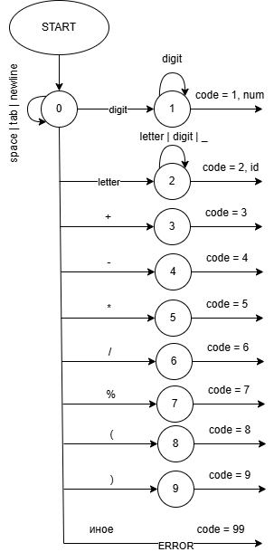
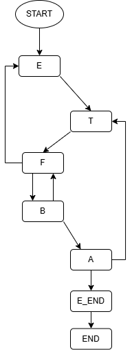
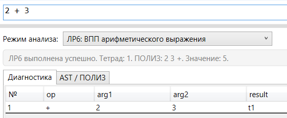
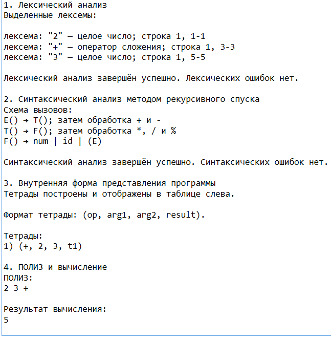
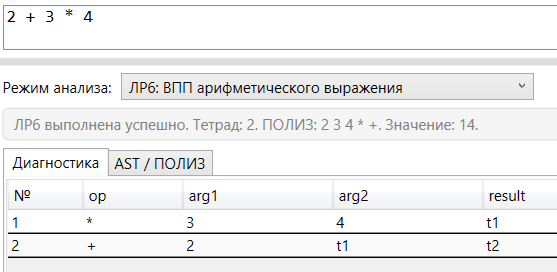
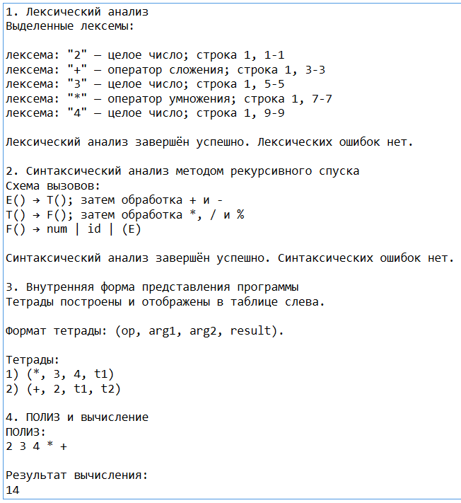
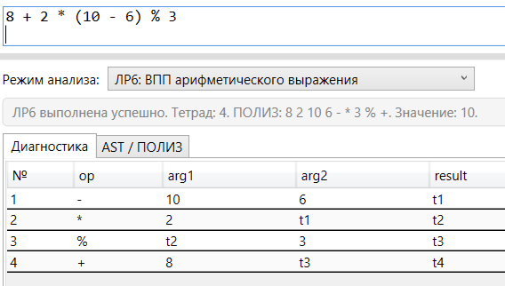
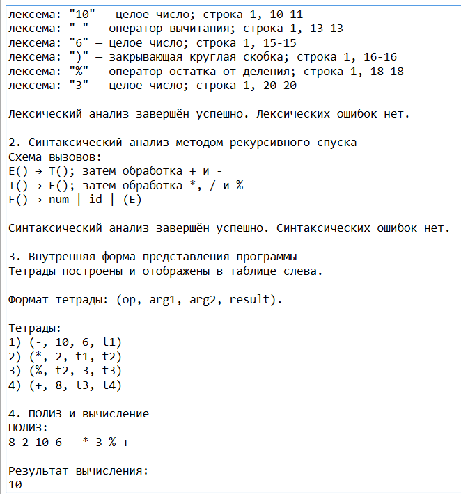
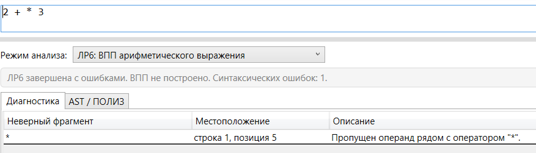

# Лабораторная работа №6

## 1. Название работы и сведения об авторе

**Название работы:** «Создание внутренней формы представления программы для арифметического выражения».

**Студент:** Вейбер А. С.  
**Группа:** АП - 327  
**Дисциплина:** «Теория формальных языков и компиляторов»  
**Лабораторная работа:** №6  
**Вариант:** арифметическое выражение

---

## 2. Постановка задачи

Цель лабораторной работы — изучить методы построения внутреннего представления программы на основе контекстно-свободной грамматики, реализовать синтаксический анализатор методом рекурсивного спуска и преобразовать арифметические выражения во внутреннюю форму.

В ходе выполнения работы необходимо:

- реализовать лексический анализ арифметического выражения;
- реализовать синтаксический анализ методом рекурсивного спуска;
- обрабатывать лексические и синтаксические ошибки;
- строить внутреннюю форму представления программы в виде тетрад;
- формировать ПОЛИЗ для выражений, состоящих только из целых чисел;
- вычислять значение выражения;
- не строить тетрады и ПОЛИЗ при наличии лексических или синтаксических ошибок.

Входными данными является строка арифметического выражения, введённая в область редактирования программы.

Результатом работы являются:

- список выделенных лексем;
- сообщения о лексических и синтаксических ошибках;
- таблица тетрад;
- ПОЛИЗ;
- результат вычисления арифметического выражения.

---

## 3. Вариант задания

Индивидуальный вариант — арифметическое выражение, заданное контекстно-свободной грамматикой.

### 3.1. Грамматика

```text
E → T A
A → ε | + T A | - T A
T → F B
B → ε | * F B | / F B | % F B
F → num | id | (E)

id → letter {letter | digit | _}
num → digit {digit}
```

### 3.2. Формальное определение грамматики

Грамматика арифметического выражения задаётся как:

```text
G[E] = (VT, VN, P, E)
```

где `E` — начальный символ грамматики.

Множество терминальных символов:

```text
VT = {num, id, +, -, *, /, %, (, )}
```

Множество нетерминальных символов:

```text
VN = {E, A, T, B, F}
```

Множество продукций:

```text
P:
E → T A
A → ε | + T A | - T A
T → F B
B → ε | * F B | / F B | % F B
F → num | id | (E)
id → letter {letter | digit | _}
num → digit {digit}
```

### 3.3. Примеры корректных строк

```text
42
```

```text
2 + 3 * 4
```

```text
(2 + 3) * 4
```

```text
17 % 5 + 2
```

```text
a + b_2 * 15
```

---

## 4. Лексический анализ

Лексический анализатор выделяет из входной строки следующие лексемы:

| Код | Лексема | Описание |
|---:|---|---|
| 1 | `num` | целое число |
| 2 | `id` | идентификатор |
| 3 | `+` | оператор сложения |
| 4 | `-` | оператор вычитания |
| 5 | `*` | оператор умножения |
| 6 | `/` | оператор деления |
| 7 | `%` | оператор остатка от деления |
| 8 | `(` | открывающая круглая скобка |
| 9 | `)` | закрывающая круглая скобка |
| 99 | `ERROR` | недопустимый символ или фрагмент |

Пробелы, табуляции и переводы строк пропускаются и не добавляются в таблицу лексем.

Идентификаторы распознаются по правилу:

```text
id → letter {letter | digit | _}
```

Числа распознаются по правилу:

```text
num → digit {digit}
```

### 4.1. Диаграмма лексического анализатора

На рисунке представлена диаграмма лексического анализатора арифметического выражения.



Диаграмма показывает переходы лексического анализатора из начального состояния к распознаванию чисел, идентификаторов, арифметических операций и круглых скобок. При встрече недопустимого символа анализатор переходит в состояние `ERROR`.

---

## 5. Синтаксический анализ методом рекурсивного спуска

Синтаксический анализатор реализован методом рекурсивного спуска.

Каждому нетерминальному символу грамматики соответствует логическая процедура разбора:

| Нетерминал | Назначение |
|---|---|
| `E` | разбор выражения верхнего уровня |
| `A` | обработка операций `+` и `-` |
| `T` | разбор терма |
| `B` | обработка операций `*`, `/`, `%` |
| `F` | разбор числа, идентификатора или выражения в скобках |

Основная идея разбора:

```text
E → T A
T → F B
```

Процедура `E` сначала вызывает разбор `T`, затем обрабатывает продолжение `A`.

Процедура `T` сначала вызывает разбор `F`, затем обрабатывает продолжение `B`.

Блок `A` отвечает за операции низкого приоритета:

```text
+ -
```

Блок `B` отвечает за операции высокого приоритета:

```text
* / %
```

Блок `F` отвечает за элементарные операнды:

```text
num
id
(E)
```

### 5.1. Схема рекурсивного спуска

На рисунке представлена схема рекурсивного спуска для грамматики арифметического выражения.



Схема отражает последовательность вызова процедур при анализе выражения. Возвратные стрелки от `A` к `T` показывают обработку операций `+` и `-`, а возвратные стрелки от `B` к `F` показывают обработку операций `*`, `/` и `%`.

---

## 6. Диагностика ошибок

В программе реализована диагностика лексических и синтаксических ошибок.

### 6.1. Лексические ошибки

Лексическая ошибка возникает, если во входной строке встречается символ, не входящий в допустимый алфавит грамматики.

Пример:

```text
2 + @
```

Ожидаемый результат:

```text
ошибка: недопустимый символ или фрагмент
```

При наличии лексических ошибок синтаксический анализ, построение тетрад и формирование ПОЛИЗ не выполняются.

### 6.2. Синтаксические ошибки

Синтаксическая ошибка возникает, если последовательность корректных лексем не соответствует грамматике.

Пример:

```text
2 + * 3
```

Ожидаемый результат:

```text
Пропущен операнд рядом с оператором "*".
```

При наличии синтаксических ошибок тетрады и ПОЛИЗ не строятся.

---

## 7. Внутренняя форма представления программы

Внутренняя форма представления программы строится в виде тетрад.

Формат тетрады:

```text
(op, arg1, arg2, result)
```

где:

- `op` — операция;
- `arg1` — первый аргумент;
- `arg2` — второй аргумент;
- `result` — временный результат.

Для хранения промежуточных результатов используются временные переменные:

```text
t1, t2, t3, ...
```

Например, для выражения:

```text
2 + 3 * 4
```

сначала строится тетрада для операции умножения:

```text
(*, 3, 4, t1)
```

затем строится тетрада для операции сложения:

```text
(+, 2, t1, t2)
```

Тетрады строятся только для корректных выражений без лексических и синтаксических ошибок.

---

## 8. ПОЛИЗ и вычисление выражения

ПОЛИЗ — польская инверсная запись, в которой операция записывается после своих операндов.

Например, выражение:

```text
2 + 3 * 4
```

с учётом приоритета операций преобразуется в ПОЛИЗ:

```text
2 3 4 * +
```

Порядок вычисления:

```text
3 * 4 = 12
2 + 12 = 14
```

Результат:

```text
14
```

ПОЛИЗ и вычисление выполняются только для выражений, состоящих исключительно из целых чисел.

Если выражение содержит идентификаторы, например:

```text
a + b_2 * 15
```

то тетрады строятся, но ПОЛИЗ и вычисление не выполняются.

---

## 9. Тестовые примеры

Ниже приведены основные тесты, использованные при проверке программы.

### 9.1. Один операнд

```text
42
```

**Ожидаемый результат:**

```text
Лексических ошибок нет.
Синтаксических ошибок нет.
Тетрад нет, так как выражение состоит из одного операнда.
ПОЛИЗ: 42
Результат: 42
```

**Скриншот:**



---

### 9.2. Простое сложение

```text
2 + 3
```

**Ожидаемые тетрады:**

```text
1) (+, 2, 3, t1)
```

**Ожидаемый ПОЛИЗ:**

```text
2 3 +
```

**Ожидаемый результат:**

```text
5
```

**Скриншот:**



---

### 9.3. Проверка приоритета операций

```text
2 + 3 * 4
```

**Ожидаемые тетрады:**

```text
1) (*, 3, 4, t1)
2) (+, 2, t1, t2)
```

**Ожидаемый ПОЛИЗ:**

```text
2 3 4 * +
```

**Ожидаемый результат:**

```text
14
```

**Скриншот:**



---

### 9.4. Проверка скобок

```text
(2 + 3) * 4
```

**Ожидаемые тетрады:**

```text
1) (+, 2, 3, t1)
2) (*, t1, 4, t2)
```

**Ожидаемый ПОЛИЗ:**

```text
2 3 + 4 *
```

**Ожидаемый результат:**

```text
20
```

**Скриншот:**



---

### 9.5. Проверка операции остатка от деления

```text
17 % 5 + 2
```

**Ожидаемые тетрады:**

```text
1) (%, 17, 5, t1)
2) (+, t1, 2, t2)
```

**Ожидаемый ПОЛИЗ:**

```text
17 5 % 2 +
```

**Ожидаемый результат:**

```text
4
```

**Скриншот:**



---

### 9.6. Проверка левой ассоциативности

```text
10 - 3 - 2
```

**Ожидаемые тетрады:**

```text
1) (-, 10, 3, t1)
2) (-, t1, 2, t2)
```

**Ожидаемый ПОЛИЗ:**

```text
10 3 - 2 -
```

**Ожидаемый результат:**

```text
5
```

**Скриншот:**



---

### 9.7. Сложное корректное выражение

```text
8 + 2 * (10 - 6) % 3
```

**Ожидаемые тетрады:**

```text
1) (-, 10, 6, t1)
2) (*, 2, t1, t2)
3) (%, t2, 3, t3)
4) (+, 8, t3, t4)
```

**Ожидаемый ПОЛИЗ:**

```text
8 2 10 6 - * 3 % +
```

**Ожидаемый результат:**

```text
10
```

**Скриншот:**


---

### 9.8. Выражение с идентификаторами

```text
a + b_2 * 15
```

**Ожидаемые тетрады:**

```text
1) (*, b_2, 15, t1)
2) (+, a, t1, t2)
```

**Ожидаемый результат:**

```text
Тетрады построены.
ПОЛИЗ и вычисление не выполняются, так как выражение содержит идентификаторы.
```

**Скриншот:**


---

### 9.9. Синтаксическая ошибка

```text
2 + * 3
```

**Ожидаемый результат:**

```text
Пропущен операнд рядом с оператором "*".
ВПП не построено.
Тетрады не построены.
ПОЛИЗ не построен.
```

**Скриншот:**


---

### 9.10. Лексическая ошибка

```text
2 + * 3 / (4 - ) @ 5
```

**Ожидаемый результат:**

```text
Обнаружена лексическая ошибка на символе "@".
Синтаксический анализ, тетрады и ПОЛИЗ не выполняются.
```

**Скриншот:**


---

## 10. Реализация

В программе использованы следующие основные компоненты.

### 10.1. Лексический анализатор выражения

Лексический анализатор выделяет:

- целые числа;
- идентификаторы;
- операции `+`, `-`, `*`, `/`, `%`;
- круглые скобки;
- недопустимые символы.

Пробельные символы пропускаются.

### 10.2. Синтаксический анализатор выражения

Синтаксический анализатор реализован методом рекурсивного спуска.

В программе используются процедуры разбора:

- `ParseE()` — разбор выражения;
- `ParseT()` — разбор терма;
- `ParseF()` — разбор фактора.

Логические части `A` и `B` реализованы через обработку повторяющихся операций:

- `A` отвечает за операции `+` и `-`;
- `B` отвечает за операции `*`, `/`, `%`.

### 10.3. Построение тетрад

Для каждого бинарного выражения создаётся тетрада формата:

```text
(op, arg1, arg2, result)
```

Промежуточные результаты сохраняются во временные переменные:

```text
t1, t2, t3, ...
```

### 10.4. Формирование ПОЛИЗ

ПОЛИЗ формируется для корректных выражений, состоящих только из целых чисел.

Формирование ПОЛИЗ выполняется по структуре разобранного выражения: сначала записываются операнды, затем операция.

### 10.5. Вычисление значения

После построения ПОЛИЗ программа вычисляет значение выражения.

Реализованы операции:

- сложение;
- вычитание;
- умножение;
- деление;
- остаток от деления.

При делении на ноль программа выводит сообщение об ошибке вычисления.

---

## 11. Инструкция по запуску

### 11.1. Запуск готовой сборки

Автономный запуск без Visual Studio выполняется через готовую сборку программы.

Порядок запуска:

- скачать архив `publish.zip`;
- распаковать архив в любую папку;
- запустить файл `GUI.exe`.

Программа запускается без установленной среды разработки и дополнительных библиотек.

### 11.2. Запуск из Visual Studio

Для запуска из Visual Studio необходимо:

- открыть решение проекта;
- выбрать проект `GUI`;
- запустить программу кнопкой `Start` или клавишей `F5`;
- в выпадающем списке выбрать режим `ЛР6: ВПП арифметического выражения`;
- ввести арифметическое выражение;
- нажать кнопку `Пуск`.

---

## 12. Вывод

В ходе выполнения лабораторной работы был реализован анализатор арифметических выражений для построения внутренней формы представления программы.

В программе реализованы:

- лексический анализ арифметического выражения;
- синтаксический анализ методом рекурсивного спуска;
- диагностика лексических и синтаксических ошибок;
- построение таблицы тетрад;
- формирование ПОЛИЗ;
- вычисление значения арифметического выражения;
- запрет построения тетрад и ПОЛИЗ при наличии ошибок;
- обработка выражений с идентификаторами.

Таким образом, программа выполняет построение внутренней формы представления программы для заданной контекстно-свободной грамматики арифметического выражения.
