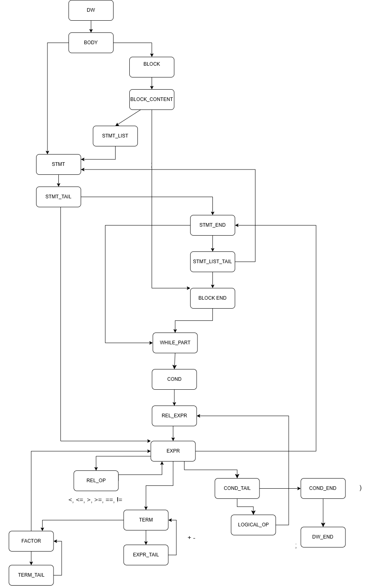
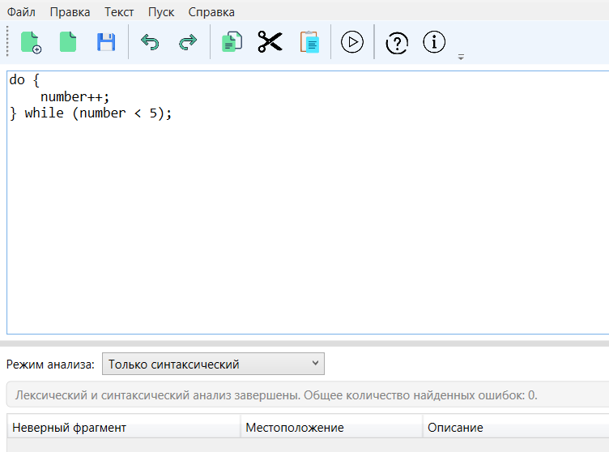
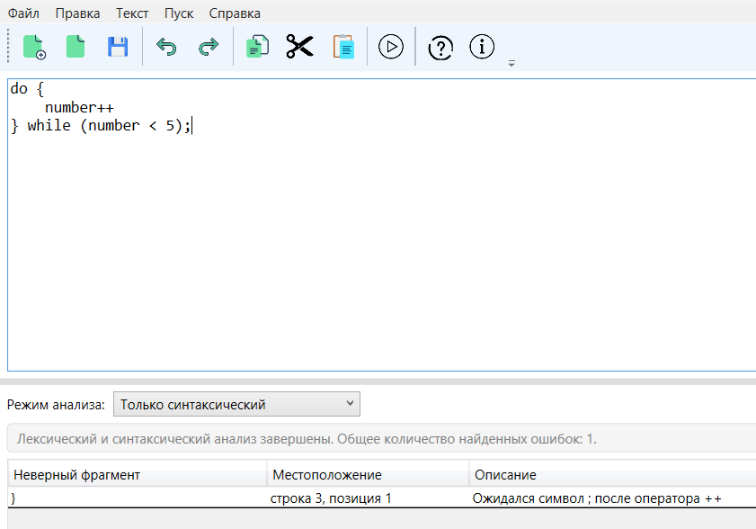
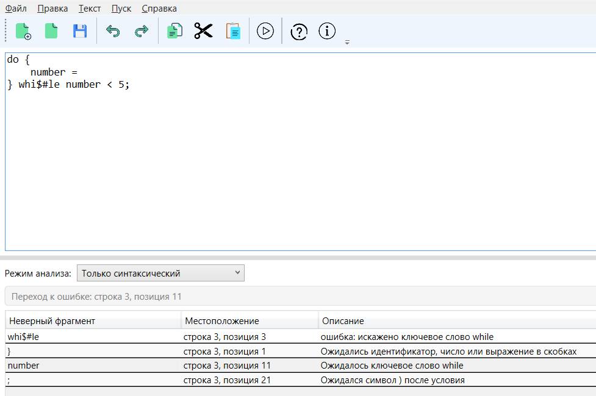
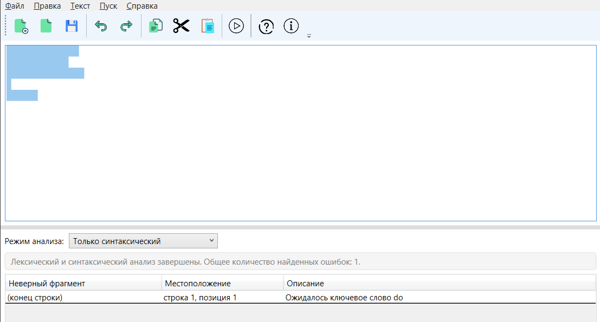
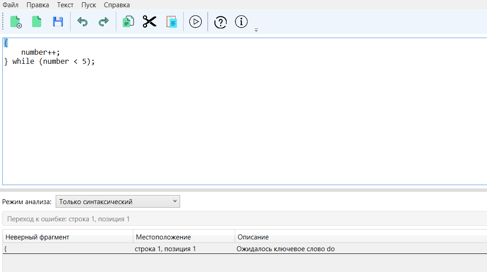

# Лабораторная работа №3

## 1. Название и цель лабораторной работы

**Название работы:** «Разработка синтаксического анализатора (парсера) для конструкции цикла `do-while` языка C++».

**Цель лабораторной работы:** изучить назначение и принципы работы синтаксического анализатора в структуре компилятора, разработать грамматику для заданной конструкции, реализовать синтаксический анализ методом рекурсивного спуска, встроить разработанный модуль в графический интерфейс языкового процессора и обеспечить диагностику и нейтрализацию ошибок в процессе разбора.

## 2. Сведения об авторе

**ФИО:** Вейбер А. С.
**Группа:** АП-327
**Дисциплина:** «Теория формальных языков и компиляторов»  
**Лабораторная работа:** №3  
**Вариант:** цикл `do-while` на языке C++

## 3. Постановка задачи

Необходимо разработать синтаксический анализатор для конструкции цикла `do-while` языка C++, интегрировать его в ранее созданное приложение, связать запуск анализа с графическим интерфейсом и обеспечить наглядный вывод результатов работы анализатора.

Входными данными является строка исходного текста из области редактирования. При корректном вводе программа должна сообщать об отсутствии ошибок. При обнаружении ошибок анализатор должен формировать таблицу с описанием ошибочного фрагмента, его местоположения и пояснением причины ошибки.

Общими требованиями являются:

- разработка грамматики для выбранной конструкции;
- классификация грамматики по Хомскому;
- выбор и реализация метода синтаксического анализа;
- организация диагностики и нейтрализации ошибок;
- передача данных из лексического анализатора в синтаксический;
- навигация к ошибочному фрагменту по щелчку в таблице результатов.

## 4. Вариант задания

**Номер варианта:** цикл `do-while` на языке C++.

**Текстовое описание варианта:** требуется распознавать конструкцию цикла `do-while`, включающую ключевое слово `do`, тело цикла в виде блока операторов или одного оператора, ключевое слово `while` и условие повторения в круглых скобках с завершающей точкой с запятой.

**Примеры корректных входных строк:**

```cpp
do {
    number++;
} while (number < 5);
```

```cpp
do counter--; while (counter > 0);
```

```cpp
do {
    sum = sum + step;
    index++;
} while (index <= 10 && sum != limit);
```

**Перечень допустимых лексем:**

- ключевые слова: `do`, `while`, `and`, `or`;
- идентификаторы: `id`;
- числа: `num` (целые без знака);
- арифметические операции: `+`, `-`, `*`, `/`;
- операции присваивания и изменения: `=`, `++`, `--`;
- операции отношения: `<`, `<=`, `>`, `>=`, `==`, `!=`;
- логические операции: `&&`, `||`, `and`, `or`;
- разделители и скобки: `{`, `}`, `(`, `)`, `;`.

Лексический анализатор также выявляет недопустимые символы, недопустимые фрагменты и искажённые ключевые слова, например `do$`, `while$`, `whi$#le` и аналогичные случаи.

## 5. Разработка грамматики

Определим грамматику цикла `do-while` языка C++ `G[<DW>]` в нотации Хомского с продукциями `P`.

### 5.1. Продукции грамматики

```text
G[<DW>]:

<DW> -> do <BODY>

<BODY> -> <BLOCK> <WHILE_PART> | <STMT> <WHILE_PART>

<BLOCK> -> { <BLOCK_CONTENT>

<BLOCK_CONTENT> -> <STMT_LIST> <BLOCK_END> | <BLOCK_END>

<BLOCK_END> -> }

<STMT_LIST> -> <STMT> <STMT_LIST_TAIL>

<STMT_LIST_TAIL> -> <STMT> <STMT_LIST_TAIL> | ε

<STMT> -> id <STMT_TAIL>

<STMT_TAIL> -> ++ <STMT_END> | -- <STMT_END> | = <EXPR> <STMT_END>

<STMT_END> -> ;

<WHILE_PART> -> while <COND>

<COND> -> ( <REL_EXPR> <COND_TAIL>

<COND_TAIL> -> <LOGICAL_OP> <REL_EXPR> <COND_TAIL> | <COND_END>

<LOGICAL_OP> -> and | or | <LOGICAL_OP_SYMBOL>

<LOGICAL_OP_SYMBOL> -> && | ||

<REL_EXPR> -> <EXPR> <REL_OP> <EXPR>

<REL_OP> -> < | <= | > | >= | == | !=

<COND_END> -> ) <DW_END>

<DW_END> -> ;

<EXPR> -> <TERM> <EXPR_TAIL>

<EXPR_TAIL> -> + <TERM> <EXPR_TAIL> | - <TERM> <EXPR_TAIL> | ε

<TERM> -> <FACTOR> <TERM_TAIL>

<TERM_TAIL> -> * <FACTOR> <TERM_TAIL> | / <FACTOR> <TERM_TAIL> | ε

<FACTOR> -> id | num | ( <EXPR> )

<IDENTIFIER> -> letter <IDENTIFIER_REM> | _ <IDENTIFIER_REM>

<IDENTIFIER_REM> -> letter <IDENTIFIER_REM> | digit <IDENTIFIER_REM> | _ <IDENTIFIER_REM> | ε

<NUMBER> -> digit <NUMBER_TAIL>

<NUMBER_TAIL> -> digit <NUMBER_TAIL> | ε

num = <NUMBER>
id = <IDENTIFIER>
letter -> 'a' | 'b' | ... | 'z' | 'A' | 'B' | ... | 'Z'
digit -> '0' | '1' | ... | '9'
```

### 5.2. Составляющие грамматики

```text
Z = <DW>

VT = { do, while, and, or, id, num, +, -, *, /, =,
       <, <=, >, >=, ==, !=, ++, --, &&, ||,
       {, }, (, ), ; }

VN = { <DW>, <BODY>, <BLOCK>, <BLOCK_CONTENT>, <BLOCK_END>,
       <STMT_LIST>, <STMT_LIST_TAIL>, <STMT>, <STMT_TAIL>, <STMT_END>,
       <WHILE_PART>, <COND>, <COND_TAIL>, <LOGICAL_OP>, <LOGICAL_OP_SYMBOL>,
       <REL_EXPR>, <REL_OP>, <COND_END>, <DW_END>,
       <EXPR>, <EXPR_TAIL>, <TERM>, <TERM_TAIL>, <FACTOR>,
       <IDENTIFIER>, <IDENTIFIER_REM>, <NUMBER>, <NUMBER_TAIL> }
```

### 5.3. Расшифровка нетерминалов

- `<DW>` — конструкция цикла `do-while`;
- `<BODY>` — тело цикла;
- `<BLOCK>` — блок операторов;
- `<BLOCK_CONTENT>` — содержимое блока;
- `<BLOCK_END>` — завершение блока;
- `<STMT_LIST>` — список операторов;
- `<STMT_LIST_TAIL>` — продолжение списка операторов;
- `<STMT>` — оператор;
- `<STMT_TAIL>` — продолжение оператора;
- `<STMT_END>` — конец оператора;
- `<WHILE_PART>` — часть конструкции с `while`;
- `<COND>` — условие цикла;
- `<COND_TAIL>` — продолжение условия;
- `<LOGICAL_OP>` — логическая операция;
- `<LOGICAL_OP_SYMBOL>` — символьная логическая операция;
- `<REL_EXPR>` — выражение отношения;
- `<REL_OP>` — операция отношения;
- `<COND_END>` — завершение условия;
- `<DW_END>` — конец конструкции `do-while`;
- `<EXPR>` — выражение;
- `<EXPR_TAIL>` — продолжение выражения;
- `<TERM>` — терм;
- `<TERM_TAIL>` — продолжение терма;
- `<FACTOR>` — множитель;
- `<IDENTIFIER>` — идентификатор;
- `<IDENTIFIER_REM>` — оставшаяся часть идентификатора;
- `<NUMBER>` — число;
- `<NUMBER_TAIL>` — оставшаяся часть числа.

Лексемы `id` и `num` формируются на этапе лексического анализа. Идентификаторы состоят из латинских букв, цифр и символа подчёркивания, а числа представлены целыми без знака. Такое разделение соответствует структуре программной реализации, в которой синтаксический анализатор работает не с отдельными символами, а с уже выделенными лексемами.

## 6. Классификация грамматики (по Хомскому)

Согласно классификации Хомского, грамматика `G[<DW>]` относится к классу контекстно-свободных грамматик. По определению, контекстно-свободная грамматика имеет правила вида: 
`A → α`, где `A ∈ VN`, `α ∈ V*` 
при этом общий словарь грамматики определяется как `V = VT ∪ VN`.

Это означает, что в левой части каждого правила должен находиться ровно один нетерминальный символ, а в правой части — произвольная последовательность терминальных и нетерминальных символов. Именно такой вид имеют все продукции разработанной грамматики `G[<DW>]`: слева в каждом правиле стоит один нетерминал (`<DW>`, `<BODY>`, `<STMT_LIST>`, `<EXPR>` и др.), а справа — допустимая цепочка символов.

Грамматика `G[<DW>]` не является автоматной, так как автоматные грамматики допускают только правила вида `A → aB`, `A → a` или `A → ε`. В разработанной грамматике имеются правила, которые не удовлетворяют этому ограничению, например:

```text
<DW> -> do <BODY>
<STMT_LIST> -> <STMT> <STMT_LIST_TAIL>
<COND_TAIL> -> <LOGICAL_OP> <REL_EXPR> <COND_TAIL> | <COND_END>
<TERM> -> <FACTOR> <TERM_TAIL>
```

Следовательно, данная грамматика не может быть отнесена к классу автоматных.

Кроме того, грамматика `G[<DW>]` не является S-грамматикой, поскольку для S-грамматик требуется, чтобы правая часть каждого правила начиналась с терминального символа, а альтернативы одного и того же нетерминала начинались с разных терминальных символов. В нашей грамматике существуют правила, начинающиеся с нетерминалов, например:

```text
<STMT_LIST> -> <STMT> <STMT_LIST_TAIL>
<EXPR> -> <TERM> <EXPR_TAIL>
<TERM> -> <FACTOR> <TERM_TAIL>
```

Таким образом, разработанная грамматика цикла `do-while` языка C++ является контекстно-свободной, но не автоматной и не S-грамматикой.

## 7. Метод анализа

Для разработанной грамматики `G[<DW>]` выбран метод рекурсивного спуска.

Суть метода состоит в том, что каждому основному нетерминалу ставится в соответствие отдельная процедура анализа. В программе используются процедуры `DW()`, `BODY()`, `BLOCK()`, `BLOCK_CONTENT()`, `STMT_LIST()`, `STMT_LIST_TAIL()`, `STMT()`, `STMT_TAIL()`, `WHILE_PART()`, `COND()`, `COND_TAIL()`, `LOGICAL_OP()`, `REL_EXPR()`, `REL_OP()`, `EXPR()`, `EXPR_TAIL()`, `TERM()`, `TERM_TAIL()`, `FACTOR()`.

Анализатор получает на вход последовательность лексем после лексического анализа. Выбор дальнейшей ветви разбора определяется текущей лексемой. Например, после `do` процедура `BODY()` различает блок `{ ... }` и одиночный оператор, `STMT_TAIL()` различает варианты `++`, `--` и `=`, а `FACTOR()` распознаёт `id`, `num` или выражение в скобках.

Для корректной строки

```cpp
do {
    number++;
} while (number < 5);
```

маршрут вызовов основных процедур имеет вид:

```text
DW -> BODY -> BLOCK -> BLOCK_CONTENT -> STMT_LIST -> STMT -> STMT_TAIL ->
STMT_LIST_TAIL -> WHILE_PART -> COND -> REL_EXPR -> EXPR -> TERM -> FACTOR ->
REL_OP -> EXPR -> TERM -> FACTOR -> COND_TAIL
```

```md

```


## 8. Диагностика и нейтрализация синтаксических ошибок

Диагностика заключается в определении места возникновения синтаксической ошибки и её типа. Нейтрализация необходима для того, чтобы после обнаружения ошибки разбор не прекращался, а продолжался дальше.

В разработанном анализаторе обработка ошибок выполнена в рамках нисходящего разбора с использованием приёмов, соответствующих идее нейтрализации ошибок по методу Айронса. Если в некоторой точке продолжение разбора по грамматике становится невозможным, анализатор фиксирует ошибку и пытается перейти к ближайшему допустимому состоянию.

В программе используются следующие приёмы:

- фиксация ошибки с указанием фрагмента и его позиции;
- виртуальная вставка ожидаемого терминала;
- пропуск входных лексем до ближайшей синхронизирующей точки;
- устранение дублирующих сообщений об одной и той же ошибке.

Если в текущем состоянии ожидается конкретный терминал, например `;`, `)`, `}` или `while`, то анализатор фиксирует ошибку и продолжает работу так, как если бы этот символ был вставлен во входную цепочку. Если же структура нарушена сильнее, выполняется переход к ближайшей допустимой лексеме, например к `;`, `}`, `while`, началу следующего оператора, логической операции или операции отношения.

Например, для строки

```cpp
do {
    number =
} while (number < 5);
```

после оператора присваивания процедура `EXPR()` не находит допустимого начала выражения. В этом случае анализатор выдаёт сообщение вида:

> Ожидались идентификатор, число или выражение в скобках.

После этого разбор продолжается, и программа дополнительно проверяет конец оператора и оставшуюся часть конструкции `while (...) ;`.

Лексические ошибки также участвуют в общей диагностике. Лексический анализатор выделяет недопустимые символы, недопустимые фрагменты и искажённые ключевые слова, например `do$`, `while$`, `whi$#le`. При этом синтаксический анализ продолжает работу по корректным лексемам потока и позволяет обнаруживать последующие синтаксические ошибки.

## 9. Тестовые примеры

Ниже приведён набор тестовых примеров. Для README достаточно оставить несколько основных скриншотов: корректный пример, пример с одной ошибкой и пример с несколькими ошибками. Остальные случаи можно привести текстом без отдельных изображений.

### 9.1. Корректная строка

```cpp
do {
    number++;
} while (number < 5);
```

```md

```

### 9.2. Пропущена точка с запятой после инкремента

```cpp
do {
    number++
} while (number < 5);
```

```md

```

### 9.3. Несколько ошибок в одной строке

```cpp
do {
    number =
} whi$#le number < 5;
```

```md



В данном примере анализатор корректно обнаруживает сразу несколько нарушений.

Во-первых, после оператора присваивания `number =` отсутствует выражение, поэтому фиксируется ошибка о том, что ожидались идентификатор, число или выражение в скобках.

Во-вторых, ключевое слово `while` записано с искажением (`whi#le`), поэтому лексический анализатор распознаёт этот фрагмент как ошибочный и передаёт информацию об этом в общую таблицу ошибок.

После завершения блока синтаксический анализатор ожидает ключевое слово `while`, однако из-за искажённой записи корректная лексема `while` в поток не попадает, поэтому дополнительно фиксируется ошибка о том, что ожидалось ключевое слово `while`.

Далее анализатор продолжает разбор оставшейся части строки и определяет, что условие записано без закрывающей круглой скобки, поэтому формируется сообщение об отсутствии символа `)` после условия.

Таким образом, пример показывает, что программа не прекращает работу после первой найденной ошибки, а продолжает разбор входной строки и накапливает несколько диагностических сообщений.

```


Ожидаемый результат: сообщение о том, что после оператора присваивания ожидалось выражение.

### 9.4. Пустая строка

```cpp

```


Ожидаемый результат: сообщение о том, что ожидалось ключевое слово `do`.

### 9.5. Строка без первого ключевого слова `do`

```cpp
{
    number++;
} while (number < 5);
```



Ожидаемый результат: сообщение о том, что ожидалось ключевое слово `do`.


