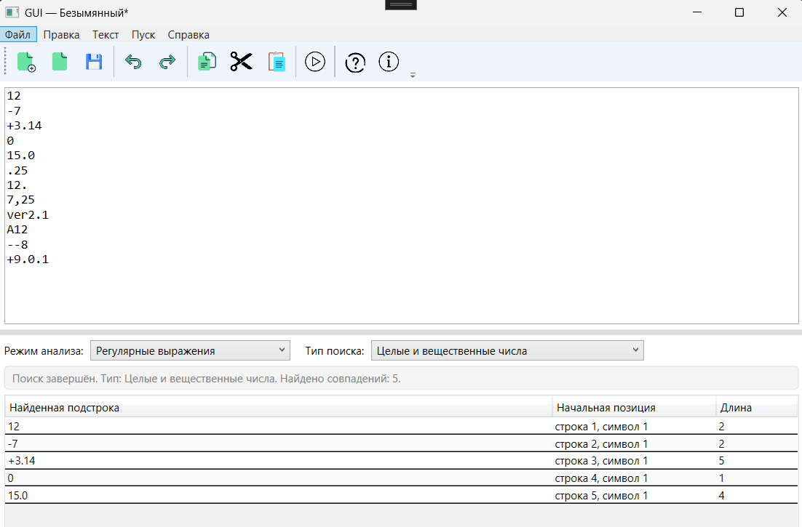
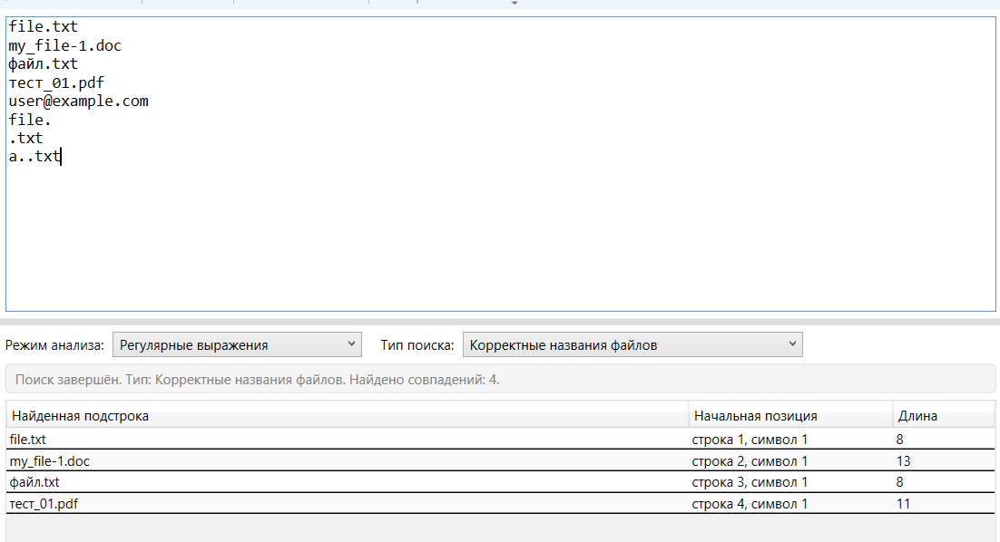
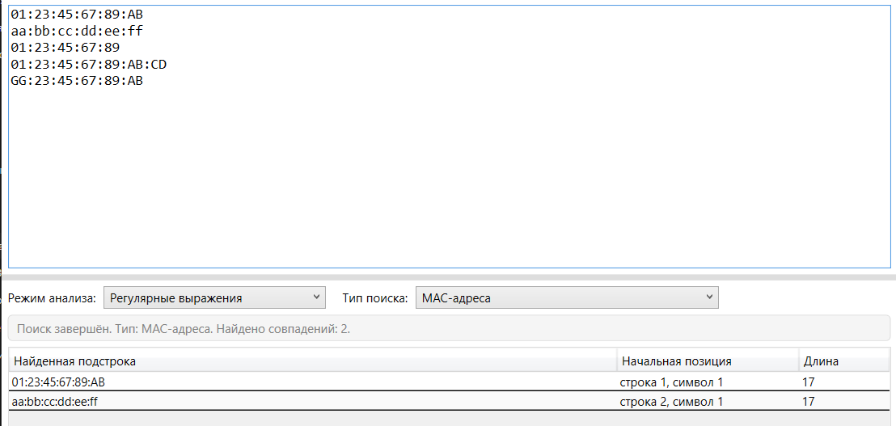
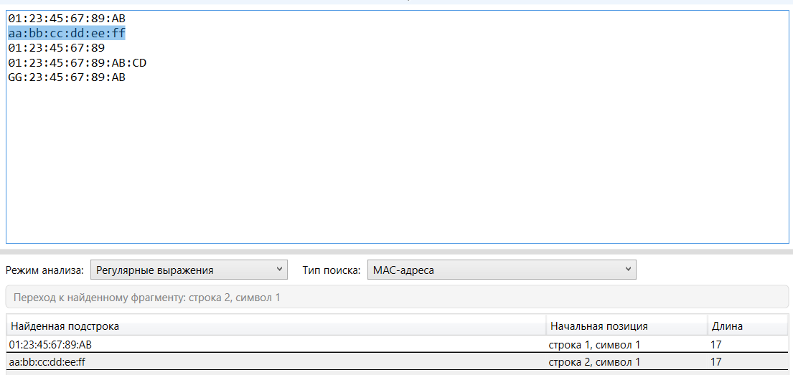
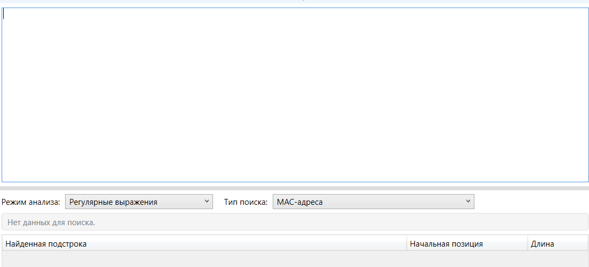
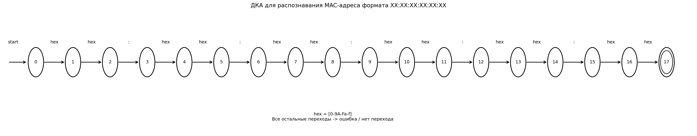
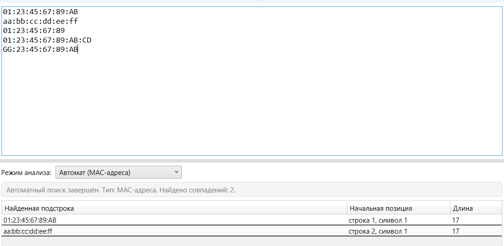

# Лабораторная работа №4

## 1. Название и цель лабораторной работы

**Название работы:** «Реализация алгоритма поиска подстрок с помощью регулярных выражений».

**Цель лабораторной работы:** изучить теоретические основы регулярных выражений и их применение для поиска и извлечения подстрок из текста, освоить практические навыки использования библиотечных средств работы с регулярными выражениями, а также выполнить интеграцию алгоритмов поиска в графический интерфейс приложения.

## 2. Сведения об авторе

**ФИО:** Вейбер А. С.  
**Группа:** АП-327  
**Дисциплина:** «Теория формальных языков и компиляторов»  
**Лабораторная работа:** №4  

## 3. Постановка задачи

Необходимо разработать модуль поиска подстрок с использованием регулярных выражений, интегрировать его в существующее приложение (текстовый редактор) и обеспечить наглядный вывод результатов. Поиск должен выполняться по тексту, введённому пользователем в область редактирования. Результаты должны выводиться в таблицу с указанием найденной подстроки, начальной позиции и длины. При выборе строки в таблице соответствующий фрагмент текста должен подсвечиваться. Также требуется вывод количества найденных совпадений.

## 4. Вариант задания

В рамках лабораторной работы реализован поиск подстрок для трёх форматов:

1. **Целые числа и числа с плавающей точкой** (разделитель — точка)  
   Базовое регулярное выражение:

```text
^[+-]?\d+(\.\d+)?$
```

2. **Корректные названия файлов**  
   Базовое регулярное выражение:

```text
^[A-Za-zА-Яа-я0-9_-]+\.[A-Za-z0-9]+$
```

3. **MAC-адреса**  
   Базовое регулярное выражение:

```text
^([0-9A-Fa-f]{2}:){5}[0-9A-Fa-f]{2}$
```

Для поиска внутри общего текста, а не только проверки одной строки целиком, в программной реализации используются адаптированные шаблоны с дополнительными проверками границ совпадения. Это позволяет избежать ложных срабатываний при поиске подстрок внутри текста.

## 5. Реализация поиска в программе

Модуль поиска встроен в графический интерфейс текстового редактора, разработанного ранее. В интерфейс добавлены:

- выбор режима анализа;
- выбор типа поиска;
- запуск анализа;
- таблица результатов;
- переход к найденному фрагменту текста с подсветкой.

В таблице результатов отображаются:

- найденная подстрока;
- начальная позиция;
- длина.

При выборе строки таблицы соответствующий фрагмент подсвечивается в текстовом поле. Для пустого текста выводится сообщение `Нет данных для поиска`. Это соответствует требованиям и рекомендациям к выполнению лабораторной работы.

## 6. Решение задач варианта

### 6.1. Поиск целых и вещественных чисел

**Описание задачи:**  
Требуется находить в тексте корректные целые числа и числа с плавающей точкой, где в качестве разделителя дробной части используется точка.

**Базовое регулярное выражение:**

```text
^[+-]?\d+(\.\d+)?$
```

**Пояснение обозначений:**

- `^` — начало строки;
- `[+-]?` — необязательный знак `+` или `-`;
- `\d+` — одна или более цифр;
- `(\.\d+)?` — необязательная дробная часть: точка и одна или более цифр;
- `$` — конец строки.

**Шаблон, используемый в программе для поиска в тексте:**

```text
(?<![\w\.,+\-])[+-]?\d+(?:\.\d+)?(?![\w\.,])
```

**Примеры строк, которые должны находиться:**

- `12`
- `-7`
- `+3.14`
- `0`
- `15.0`

**Примеры строк, которые не должны находиться:**

- `.25`
- `12.`
- `7,25`
- `ver2.1`
- `A12`
- `--8`
- `+9.0.1`

#### Тестовый пример

**Текст для проверки:**

```text
12
-7
+3.14
0
15.0
.25
12.
7,25
ver2.1
A12
--8
+9.0.1
```

**Ожидаемый результат:** должно быть найдено **5 совпадений** — `12`, `-7`, `+3.14`, `0`, `15.0`.



### 6.2. Поиск корректных названий файлов

**Описание задачи:**  
Требуется находить в тексте корректные названия файлов, состоящие из имени файла и расширения.

**Базовое регулярное выражение:**

```text
^[A-Za-zА-Яа-я0-9_-]+\.[A-Za-z0-9]+$
```

**Пояснение обозначений:**

- `^` — начало строки;
- `[A-Za-zА-Яа-я0-9_-]+` — имя файла: одна или более букв русского или латинского алфавита, цифр, символов `_` и `-`;
- `\.` — точка между именем и расширением;
- `[A-Za-z0-9]+` — расширение файла: одна или более латинских букв или цифр;
- `$` — конец строки.

**Шаблон, используемый в программе для поиска в тексте:**

```text
(?<![\w.@])[A-Za-zА-Яа-я0-9_-]+\.[A-Za-z0-9]+(?![\w.])
```

**Примеры строк, которые должны находиться:**

- `file.txt`
- `my_file-1.doc`
- `файл.txt`
- `тест_01.pdf`

**Примеры строк, которые не должны находиться:**

- `user@example.com`
- `file.`
- `.txt`
- `a..txt`

#### Тестовый пример

**Текст для проверки:**

```text
file.txt
my_file-1.doc
файл.txt
тест_01.pdf
user@example.com
file.
.txt
a..txt
```

**Ожидаемый результат:** должны быть найдены только корректные имена файлов.



### 6.3. Поиск MAC-адресов

**Описание задачи:**  
Требуется находить в тексте корректные MAC-адреса формата `XX:XX:XX:XX:XX:XX`, где `X` — шестнадцатеричный символ.

**Базовое регулярное выражение:**

```text
^([0-9A-Fa-f]{2}:){5}[0-9A-Fa-f]{2}$
```

**Пояснение обозначений:**

- `^` — начало строки;
- `([0-9A-Fa-f]{2}:){5}` — пять групп, каждая из которых состоит из двух hex-символов и двоеточия;
- `[0-9A-Fa-f]{2}` — последняя пара hex-символов;
- `$` — конец строки.

**Шаблон, используемый в программе для поиска в тексте:**

```text
(?<![A-Za-z0-9_:\-])(?:[0-9A-Fa-f]{2}:){5}[0-9A-Fa-f]{2}(?![A-Za-z0-9_:\-])
```

**Примеры строк, которые должны находиться:**

- `01:23:45:67:89:AB`
- `aa:bb:cc:dd:ee:ff`

**Примеры строк, которые не должны находиться:**

- `01:23:45:67:89`
- `01:23:45:67:89:AB:CD`
- `GG:23:45:67:89:AB`

#### Тестовый пример

**Текст для проверки:**

```text
01:23:45:67:89:AB
aa:bb:cc:dd:ee:ff
01:23:45:67:89
01:23:45:67:89:AB:CD
GG:23:45:67:89:AB
```

**Ожидаемый результат:** должны быть найдены только корректные MAC-адреса.



## 7. Подсветка найденного фрагмента

Одним из требований лабораторной работы является подсветка найденной подстроки в исходном тексте при выборе строки в таблице результатов. В программе это реализовано через переход к позиции найденного фрагмента и выделение соответствующего участка текста.



## 8. Обработка пустого текста

Если пользователь запускает поиск при пустом текстовом поле, программа не выполняет анализ и выводит сообщение:

```text
Нет данных для поиска.
```

Такая обработка отдельно рекомендуется в требованиях к выполнению лабораторной работы.



## 9. Дополнительное задание

В качестве дополнительного задания реализован поиск подстрок через граф автомата для задачи поиска MAC-адресов. Дополнительное задание допускает использование задачи из 2 или 3 блока варианта, а также требует дополнить README графом автомата и тестовыми примерами поиска.

### 9.1. Теоретическая основа

Конечный автомат задаётся пятёркой:

```text
A = (S, Σ, s0, δ, F)
```

где:

- `S` — множество состояний;
- `Σ` — входной алфавит;
- `s0` — начальное состояние;
- `δ` — функция переходов;
- `F` — множество заключительных состояний.

Цепочка принимается автоматом, если из начального состояния он переходит в одно из заключительных состояний. Язык автомата — это множество всех цепочек, принимаемых данным автоматом.

### 9.2. Граф автомата для MAC-адреса

Для распознавания MAC-адреса построен детерминированный конечный автомат.  
Обозначим:

```text
H = [0-9A-Fa-f]
```

Тогда переходы автомата имеют вид:

```text
start -> q0
q0  --H--> q1
q1  --H--> q2
q2  --:--> q3
q3  --H--> q4
q4  --H--> q5
q5  --:--> q6
q6  --H--> q7
q7  --H--> q8
q8  --:--> q9
q9  --H--> q10
q10 --H--> q11
q11 --:--> q12
q12 --H--> q13
q13 --H--> q14
q14 --:--> q15
q15 --H--> q16
q16 --H--> q17
```

**Заключительное состояние:** `q17`.

Этот автомат соответствует программной реализации `MacAddressAutomatonSearcher`, в которой заключительное состояние задано как `17`, а переходы описаны методом `GetNextState(...)`. Проверка допустимости символа выполняется методом `IsHex(...)`. Границы совпадения в тексте дополнительно контролируются отдельно.



### 9.3. Тестовый пример автоматного поиска

**Текст для проверки:**

```text
01:23:45:67:89:AB
aa:bb:cc:dd:ee:ff
01:23:45:67:89
01:23:45:67:89:AB:CD
GG:23:45:67:89:AB
```

**Ожидаемый результат:** автомат должен найти только корректные MAC-адреса.



## 10. Итог

В ходе выполнения лабораторной работы был разработан модуль поиска подстрок на основе регулярных выражений, встроенный в графический интерфейс текстового редактора. Реализован поиск для трёх форматов: чисел, имён файлов и MAC-адресов. Результаты поиска отображаются в таблице, содержат найденную подстроку, её позицию и длину, а также поддерживают переход к фрагменту текста с подсветкой. Дополнительно для MAC-адресов реализован автоматный поиск через граф конечного автомата, что соответствует условиям дополнительного задания.
