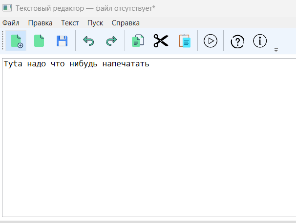
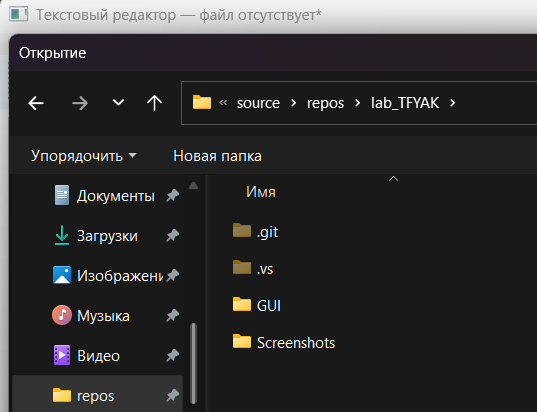

# Лабораторная работа №1  

## Разработка графического интерфейса (GUI) для языкового процессора  

---

## 1. Название и цель лабораторной работы

Название: Разработка пользовательского интерфейса (GUI) для языкового процессора.

Цель работы:  

Создание кроссплатформенного графического интерфейса (GUI) для языкового процессора в виде специализированного текстового редактора.

---

## 2. Сведения об авторе

ФИО: Вейбер А.С.   

Группа: АП-327

Дисциплина: Теория формальных языков и компиляторов  

&nbsp;

---

## 3. Описание проекта

Разработано оконное приложение — текстовый редактор с графическим интерфейсом пользователя.

Программа содержит:

- Главное меню;

- Панель инструментов;

- Область ввода и редактирования текста;

- Область отображения результатов работы (только для чтения).

Реализованы функции работы с файлами, стандартные операции редактирования текста, система справки и окно «О программе».

Команда «Пуск» на текущем этапе реализована в виде заглушки (вывод статистики текста).  

Приложение создано с учетом дальнейшего расширения до полноценного языкового процессора.

---

## 4. Используемые технологии

Язык программирования: C#  

Фреймворк для GUI: WPF (.NET 8.0)  

Среда разработки: Visual Studio 2022  

Тип публикации: Self-contained (автономная сборка)

---

## 5. Инструкция по сборке и запуску

### Путь к готовому исполняемому файлу
Автономный запуск (без Visual Studio)
Для запуска без установленной среды разработки используется автономная сборка (Self-contained).
Готовая версия программы доступна во вкладке Releases данного репозитория.
Порядок запуска:
- Скачать архив publish.zip.
- Распаковать архив в любую папку.
- Запустить файл GUI.exe.

Программа запускается без установленной среды разработки и дополнительных библиотек.

---

## 6. Описание интерфейса и функций (руководство пользователя)

---

### Главное окно

Главное окно содержит:

1. Основное меню  

2. Панель инструментов  

3. Область редактирования текста  

4. Область вывода результатов  

Размер окна и соотношение рабочих областей можно изменять с помощью разделителя (GridSplitter).  

При необходимости автоматически появляются полосы прокрутки.

---

### Меню «Файл»

Функции:

- **Создать** — очистка редактора  

- **Открыть** — загрузка текстового файла  

- **Сохранить** — сохранение изменений  

- **Сохранить как** — сохранение в новый файл  

- **Выход** — закрытие программы (с подтверждением сохранения изменений)

Вызов: меню «Файл» или соответствующие кнопки панели инструментов.

---

### Меню «Правка»

- **Отменить** (Ctrl+Z)  

- **Повторить** (Ctrl+Y)  

- **Вырезать** (Ctrl+X)  

- **Копировать** (Ctrl+C)  

- **Вставить** (Ctrl+V)  

- **Удалить** (Del)  

- **Выделить всё** (Ctrl+A)

Вызов: меню «Правка», кнопки панели инструментов или горячие клавиши.

---

\### Меню «Текст»

Открывает окна с теоретической информацией:

- Постановка задачи  

- Грамматика  

- Классификация грамматики  

- Метод анализа  

- Тестовый пример  

- Список литературы  

- Исходный код программы  

---

### Команда «Пуск»

Запуск анализа текста (на данном этапе — заглушка).

Выводит:

- Количество строк  

- Количество символов  

- Время выполнения  

Результат отображается в нижней области.

---

### Меню «Справка»

- **Вызов справки** — описание функций программы  

- **О программе** — информация об авторе и проекте  

---

### Панель инструментов

Панель содержит 11 кнопок быстрого доступа:

| Кнопка | Назначение | Горячая клавиша |
|--------|------------|----------------|
| Создать | Новый документ | — |
| Открыть | Открытие файла | — |
| Сохранить | Сохранение | — |
| Отменить | Undo | Ctrl+Z |
| Повторить | Redo | Ctrl+Y |
| Копировать | Copy | Ctrl+C |
| Вырезать | Cut | Ctrl+X |
| Вставить | Paste | Ctrl+V |
| Пуск | Запуск анализа | — |
| Справка | Открытие справки | — |
| О программе | Информация о программе | — |

Все кнопки панели инструментов связаны с соответствующими пунктами меню.

---

### Область редактирования текста

Предназначена для ввода и редактирования текста.  

Поддерживает стандартные операции редактирования и горячие клавиши.

---

### Область вывода результатов

Предназначена для отображения результатов работы программы.  

Редактирование текста в этой области запрещено.

---

### Примеры работы программы

**1. Создание нового документа**  

Меню «Файл» → Создать.  

Редактор очищается.

**2. Открытие файла**  

Меню «Файл» → Открыть → выбор файла.  

Содержимое загружается в область редактирования.

---

## 7. Особенности реализации и ограничения

**Особеннности реализации**

- Реализован механизм проверки несохранённых изменений перед закрытием программы или открытием нового файла.

- Горячие клавиши реализованы через стандартные механизмы WPF и связаны с командами меню.

- Теоретические разделы (меню «Текст») загружаются из внешних текстовых файлов, что позволяет изменять содержимое без перекомпиляции проекта.

- Приложение опубликовано в режиме Self-contained (автономное развертывание) и запускается без установленной среды разработки и дополнительных библиотек.

**Ограничения**

- Синтаксический анализатор - в текущей версии реализована имитация работы анализатора. Полноценный анализатор будет реализован на следующих этапах работы.

- Работа с несколькими вкладками не реализована.

- Форматы файлов - поддерживаются только форматы TXT и RTF. Другие форматы открываются как текстовые.

