# Лабораторная работа №7

## 1. Название работы и сведения об авторе

**Название работы:** «Преобразование и анализ кода с использованием Clang и LLVM».  
**Студент:** Вейбер Александр Сергеевич  
**Группа:** АП-327  
**Дисциплина:** «Теория формальных языков и компиляторов»  
**Лабораторная работа:** №7  
**Индивидуальный вариант:** цикл `do-while`

---

## 2. Постановка задачи

Цель лабораторной работы — познакомиться с инструментами **Clang** и **LLVM**, научиться получать абстрактное синтаксическое дерево программы, генерировать промежуточное представление LLVM IR, применять оптимизации и строить граф потока управления программы.

В рамках общей части необходимо:

- установить Clang, LLVM, `opt` и Graphviz;
- создать простой C-файл с функцией `square` и функцией `main`;
- получить AST программы;
- получить LLVM IR без оптимизаций и с оптимизациями;
- сравнить IR до и после оптимизации;
- построить CFG для функции программы;
- сделать выводы о работе Clang/LLVM.

В рамках индивидуального задания необходимо исследовать конструкцию `do-while`:

- получить IR для `-O0`;
- получить IR для `-O2` и определить применённые оптимизации;
- применить оптимизации `loop-unroll` и `loop-rotate`;
- построить CFG;
- сравнить представление `do-while` и `while` в IR.

Скриншот индивидуального варианта:

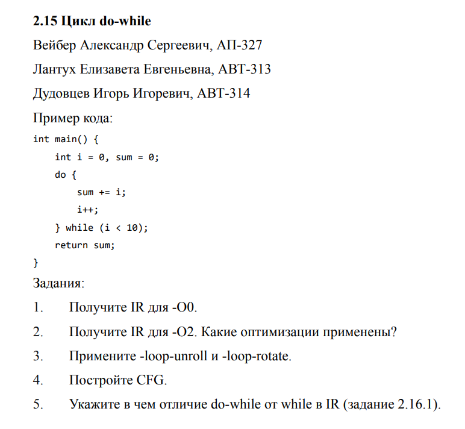

---

## 3. Подготовка среды

Работа выполнялась в среде Ubuntu. Для установки инструментов использовались команды:

```bash
sudo apt update
sudo apt install clang llvm graphviz -y
```

Проверка установленных инструментов:

```bash
clang --version
opt --version
dot -V
```

Скриншот проверки версий Clang, LLVM `opt` и Graphviz:

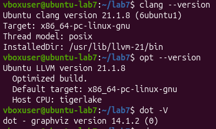

По результату проверки установлены:

- Ubuntu Clang version 21.1.8;
- Ubuntu LLVM version 21.1.8;
- Graphviz version 14.1.2.

---

## 4. Общая часть работы

### 4.1. Исходный код

Для общей части был создан файл `main.c`:

```c
#include <stdio.h>

int square(int x) {
    return x * x;
}

int main() {
    int a = 5;
    int b = square(a);
    printf("%d\n", b);
    return 0;
}
```

Скриншот файла `main.c`:

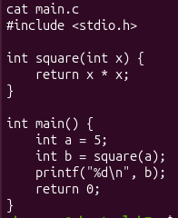

Программа содержит две функции:

- `square(int x)` — возвращает произведение `x * x`;
- `main()` — задаёт значение `a = 5`, вызывает `square(a)`, выводит результат и завершает работу.

### 4.2. Получение AST

Команда для получения AST:

```bash
clang -Xclang -ast-dump -fsyntax-only main.c
```

В AST отображаются пользовательские функции `square` и `main`. Для функции `square` видно объявление параметра `x` типа `int` и выражение умножения `x * x`. Для функции `main` отображаются объявления переменных `a` и `b`, вызов функции `square(a)`, вызов `printf` и оператор `return 0`.

AST удобен для анализа синтаксической структуры исходной программы, потому что он сохраняет связь с исходным языком C.

### 4.3. Генерация LLVM IR без оптимизаций

Команда:

```bash
clang -O0 -S -emit-llvm main.c -o main_O0.ll
```

В IR без оптимизаций локальные переменные размещаются в памяти через `alloca`, а работа со значениями выполняется через инструкции `load` и `store`. Функция `square` вызывается как отдельная функция.

Фрагмент IR без оптимизаций для функции `square`:

```llvm
define dso_local i32 @square(i32 noundef %0) #0 {
  %2 = alloca i32, align 4
  store i32 %0, ptr %2, align 4
  %3 = load i32, ptr %2, align 4
  %4 = load i32, ptr %2, align 4
  %5 = mul nsw i32 %3, %4
  ret i32 %5
}
```

### 4.4. Генерация LLVM IR с оптимизацией `-O2`

Команда:

```bash
clang -O2 -S -emit-llvm main.c -o main_O2.ll
```

После оптимизации компилятор упрощает функцию `main`: значение `square(5)` может быть вычислено на этапе компиляции, поэтому в `main` остаётся вызов `printf` уже со значением `25`.

Фрагмент оптимизированного IR:

```llvm
define dso_local noundef i32 @main() local_unnamed_addr #1 {
  %1 = tail call i32 (ptr, ...) @printf(ptr noundef nonnull dereferenceable(1) @.str, i32 noundef 25)
  ret i32 0
}
```

Основные изменения после `-O2`:

- уменьшается количество лишних инструкций;
- исчезают ненужные обращения к памяти;
- код становится ближе к SSA-форме;
- вызов короткой функции может быть встроен;
- выражение с известными значениями может быть вычислено заранее.

### 4.5. Построение CFG общей программы

Для построения CFG использовались команды:

```bash
clang -O2 -S -emit-llvm main.c -o main_O2.ll
opt -passes=dot-cfg -disable-output main_O2.ll
dot -Tpng .main.dot -o cfg_main.png
xdg-open cfg_main.png
```

CFG функции `main` после оптимизации:

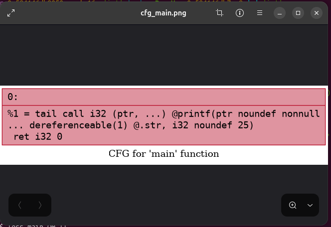

После оптимизации граф функции `main` состоит из одного базового блока, потому что в программе не осталось ветвлений и циклов.

---

## 5. Индивидуальное задание: цикл `do-while`

### 5.1. Исходный код индивидуального варианта

Для индивидуального задания был создан файл `dowhile.c`:

```c
int main() {
    int i = 0, sum = 0;

    do {
        sum += i;
        i++;
    } while (i < 10);

    return sum;
}
```

Скриншот исходного кода:

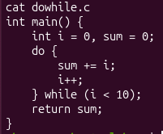

Смысл программы: цикл выполняется от `i = 0` до `i = 9`, на каждой итерации значение `i` добавляется к `sum`. Итоговая сумма равна:

```text
0 + 1 + 2 + 3 + 4 + 5 + 6 + 7 + 8 + 9 = 45
```

### 5.2. AST конструкции `do-while` средствами Clang

Команда:

```bash
clang -Xclang -ast-dump -Xclang -ast-dump-filter=main -fsyntax-only dowhile.c
```

Скриншот AST:

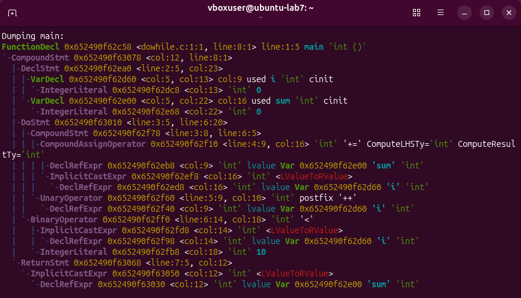

В AST видно, что цикл `do-while` представлен узлом `DoStmt`. Внутри него находятся:

- блок тела цикла `CompoundStmt`;
- операция `sum += i`, представленная через `CompoundAssignOperator`;
- операция `i++`, представленная через `UnaryOperator`;
- условие `i < 10`, представленное через `BinaryOperator '<'`.

Таким образом, AST показывает исходную синтаксическую структуру цикла: сначала тело, затем условие.

### 5.3. LLVM IR для `do-while` без оптимизаций `-O0`

Команда:

```bash
clang -O0 -S -emit-llvm dowhile.c -o dowhile_O0.ll
```

Скриншот IR без оптимизаций:

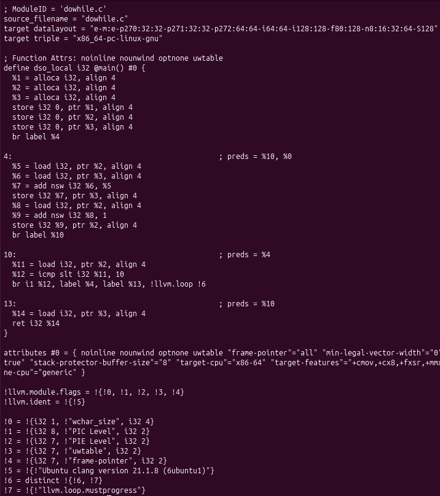

Фрагмент IR:

```llvm
define dso_local i32 @main() #0 {
  %1 = alloca i32, align 4
  %2 = alloca i32, align 4
  %3 = alloca i32, align 4
  store i32 0, ptr %1, align 4
  store i32 0, ptr %2, align 4
  store i32 0, ptr %3, align 4
  br label %4

4:
  %5 = load i32, ptr %2, align 4
  %6 = load i32, ptr %3, align 4
  %7 = add nsw i32 %6, %5
  store i32 %7, ptr %3, align 4
  %8 = load i32, ptr %2, align 4
  %9 = add nsw i32 %8, 1
  store i32 %9, ptr %2, align 4
  br label %10

10:
  %11 = load i32, ptr %2, align 4
  %12 = icmp slt i32 %11, 10
  br i1 %12, label %4, label %13

13:
  %14 = load i32, ptr %3, align 4
  ret i32 %14
}
```

Особенность `do-while` в IR состоит в том, что сначала управление переходит в тело цикла (`br label %4`), и только после выполнения тела происходит проверка условия в блоке `%10`. Если условие истинно, управление возвращается в тело цикла, если ложно — происходит выход.

### 5.4. LLVM IR для `do-while` после оптимизации `-O2`

Команда:

```bash
clang -O2 -S -emit-llvm dowhile.c -o dowhile_O2.ll
```

Скриншот IR после оптимизации:

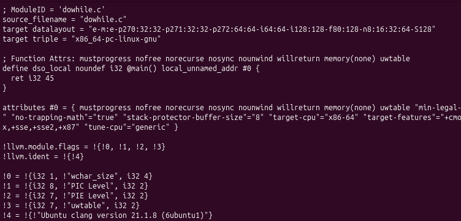

Результат после оптимизации:

```llvm
define dso_local noundef i32 @main() local_unnamed_addr #0 {
  ret i32 45
}
```

Компилятор полностью вычислил результат цикла на этапе компиляции. Это стало возможным, потому что:

- начальные значения `i` и `sum` известны;
- граница цикла `i < 10` известна;
- тело цикла не содержит побочных эффектов;
- итоговое значение можно вычислить заранее.

Применённые оптимизации:

- устранение лишних обращений к памяти;
- анализ индукционной переменной `i`;
- свёртка вычислений;
- удаление мёртвого кода;
- упрощение графа потока управления.

### 5.5. Применение `loop-rotate`

Для анализа преобразования структуры цикла применялась оптимизация `loop-rotate`:

```bash
opt -S -passes='loop-rotate' dowhile_O0.ll -o dowhile_rotated.ll
```

Скриншот результата:

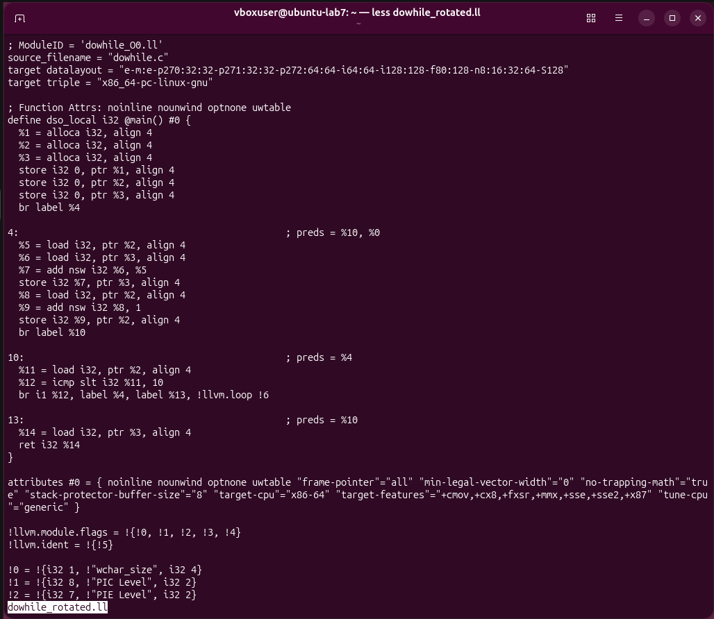

`loop-rotate` перестраивает форму цикла так, чтобы проверка условия и переходы были представлены в более удобном для последующих оптимизаций виде. На IR, полученном при `-O0`, эффект может быть небольшим, потому что такой IR содержит `alloca`, `load`, `store` и атрибут `optnone`. Поэтому для более заметного эффекта обычно используют IR без `optnone` и предварительно применяют преобразования вроде `mem2reg`, `loop-simplify` и `lcssa`.

### 5.6. Применение `loop-unroll`

Для разворачивания цикла применялась оптимизация `loop-unroll`:

```bash
opt -S -passes='loop-unroll' dowhile_O0.ll -o dowhile_unrolled.ll
```

Скриншот результата:

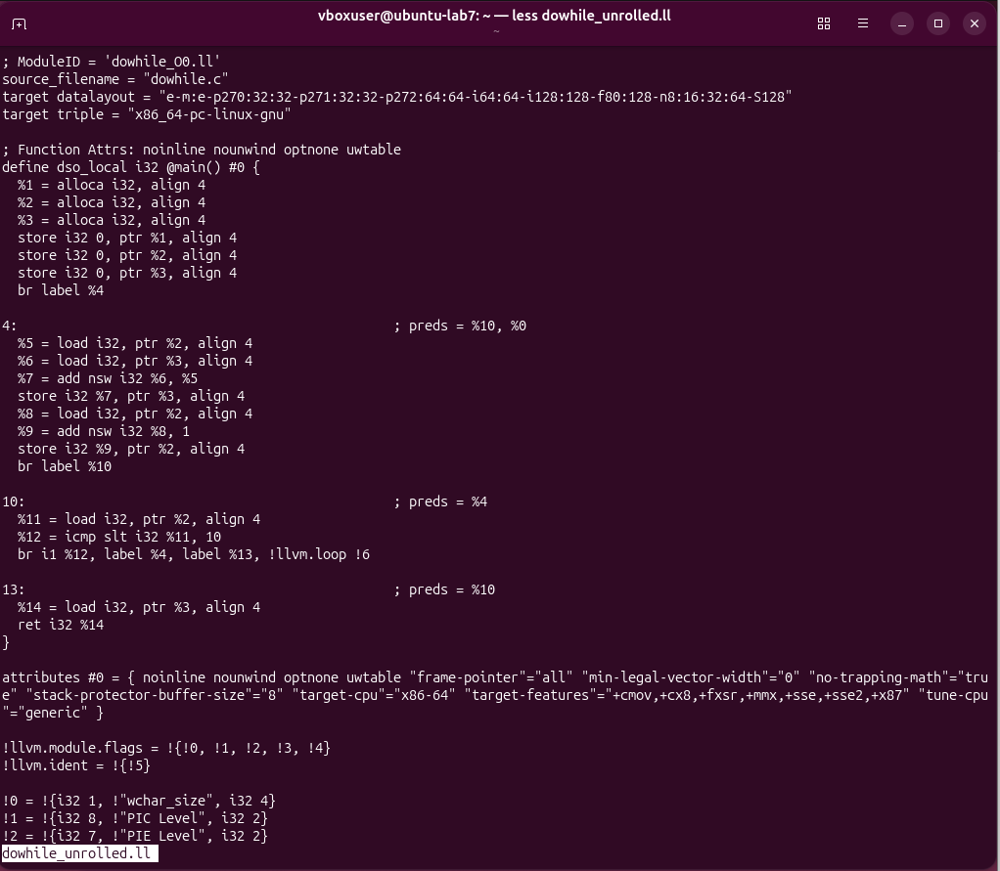

`loop-unroll` предназначен для разворачивания цикла, то есть замены нескольких итераций повторяющимися инструкциями. Такая оптимизация уменьшает количество переходов и проверок условия. Для данного примера при полной оптимизации `-O2` цикл не просто разворачивается, а полностью вычисляется до константного результата `45`.

### 5.7. CFG для `do-while`

CFG был построен командами:

```bash
opt -passes=dot-cfg -disable-output dowhile_O0.ll
dot -Tpng .main.dot -o cfg_dowhile.png
xdg-open cfg_dowhile.png
```

CFG для `do-while`:

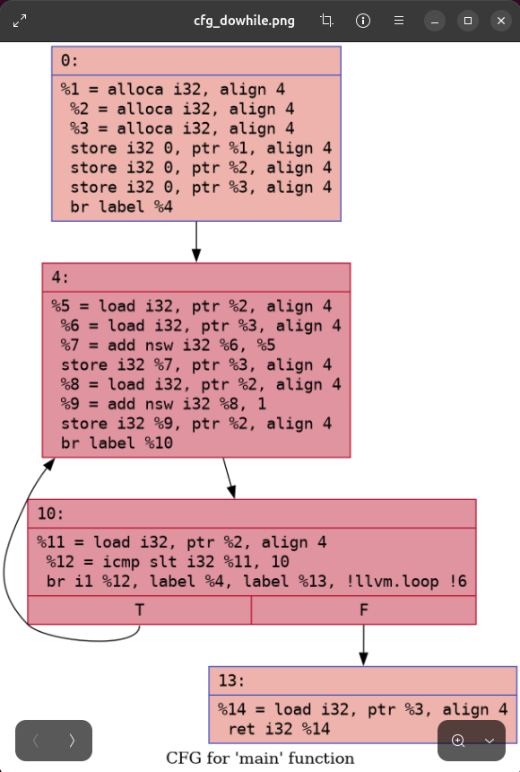

В CFG видно, что тело цикла выполняется до проверки условия. Сначала управление переходит в блок тела, затем в блок условия. При истинном условии управление возвращается в тело, при ложном — выходит из цикла.

### 5.8. Отличие `do-while` от `while` в IR

Для сравнения был рассмотрен цикл `while`:

```c
int main() {
    int i = 0, sum = 0;

    while (i < 10) {
        sum += i;
        i++;
    }

    return sum;
}
```

IR для `while` без оптимизаций:

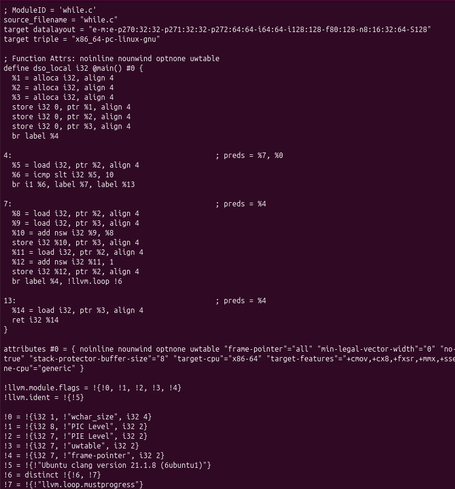

CFG для `while`:

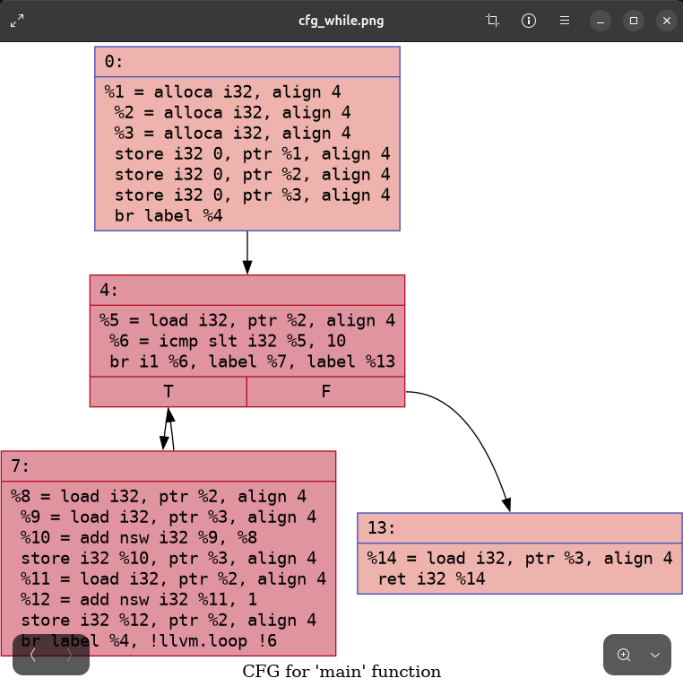

Главное отличие:

- `do-while`: сначала выполняется тело цикла, затем проверяется условие;
- `while`: сначала проверяется условие, затем выполняется тело цикла.

Поэтому цикл `do-while` всегда выполняет тело хотя бы один раз, а цикл `while` может не выполниться ни разу, если условие изначально ложно.

В IR это отражается расположением базовых блоков. У `do-while` первый переход ведёт в блок тела цикла, а проверка условия находится после тела. У `while` первый переход ведёт к блоку проверки условия, и только при истинном результате выполняется тело.

---

## 6. Дополнительное задание

### 6.1. Суть дополнительного задания

Для выбранной синтаксической конструкции `do-while` было выполнено дополнительное задание:

- построено AST конструкции из лабораторной работы №5;
- построено CST конструкции из лабораторной работы №5;
- реализована генерация промежуточного представления в виде трёхадресного кода;
- реализованы две локальные оптимизации;
- работа оптимизаций продемонстрирована в GUI программы.

### 6.2. AST конструкции `do-while` из лабораторной работы №5

Для конструкции:

```c
do {
    number++;
} while (number < 5);
```

было построено AST:

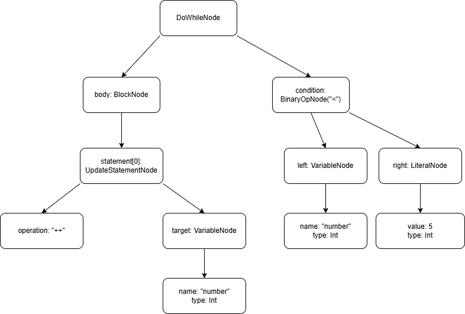

Корневой узел AST — `DoWhileNode`. У него два основных потомка:

- `body: BlockNode` — тело цикла;
- `condition: BinaryOpNode("<")` — условие продолжения цикла.

Тело содержит оператор `UpdateStatementNode` с операцией `++` для переменной `number`. Условие содержит левый операнд `VariableNode` с именем `number` и правый операнд `LiteralNode` со значением `5`.

AST является упрощённым деревом: в нём остаются смысловые элементы конструкции, но не показываются все служебные элементы синтаксиса.

### 6.3. CST конструкции `do-while` из лабораторной работы №5

CST показывает полное синтаксическое дерево конструкции:

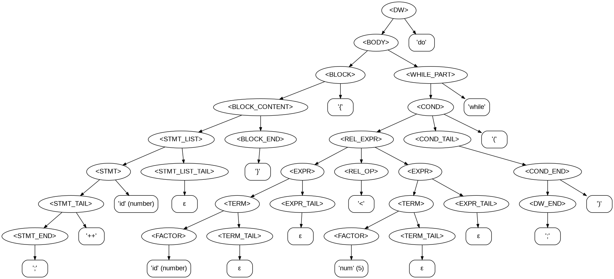

В CST отображаются как нетерминалы грамматики, так и терминальные символы:

- `<DW>`;
- `<BODY>`;
- `<BLOCK>`;
- `<STMT_LIST>`;
- `<COND>`;
- ключевые слова `do` и `while`;
- скобки `{`, `}`, `(`, `)`;
- точка с запятой `;`.

Главное отличие CST от AST: CST хранит полную структуру разбора по грамматике, а AST оставляет только смысловые узлы, необходимые для анализа и дальнейшего преобразования программы.

### 6.4. Генерация трёхадресного кода TAC

Для конструкции `do-while` была реализована генерация трёхадресного кода. В программе используются следующие основные компоненты:

- `TacInstruction` — одна инструкция трёхадресного кода;
- `TacGenerator` — генератор TAC по AST `DoWhileNode`;
- `TacOptimizer` — набор локальных оптимизаций TAC.

Общий шаблон TAC для `do-while`:

```text
L1:
<инструкции тела цикла>
L2:
<вычисление условия>
if condition == 0 goto L3
goto L1
L3:
```

Такой шаблон соответствует семантике `do-while`: сначала выполняется тело, затем проверяется условие.

Пример TAC для конструкции:

```c
do {
    number++;
} while (number < 5);
```

```text
L1:
number = number + 1
L2:
t1 = number < 5
if t1 == 0 goto L3
goto L1
L3:
```

Скриншот построения TAC в GUI:

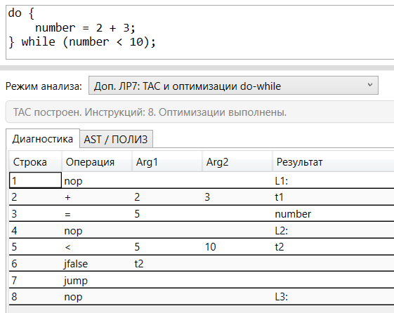

### 6.5. Локальная оптимизация 1: свёртка констант

Первая реализованная оптимизация — **свёртка констант**.

Смысл оптимизации: если операция выполняется над двумя известными числовыми константами, результат можно вычислить сразу и заменить операцию обычным присваиванием.

Пример до оптимизации:

```text
t1 = 2 + 3
number = t1
```

После свёртки констант:

```text
t1 = 5
number = t1
```

Если условный переход зависит от константы, он также может быть упрощён. Например:

```text
if 0 == 0 goto L3
```

может быть заменено на:

```text
goto L3
```

Обобщённая блок-схема оптимизации:

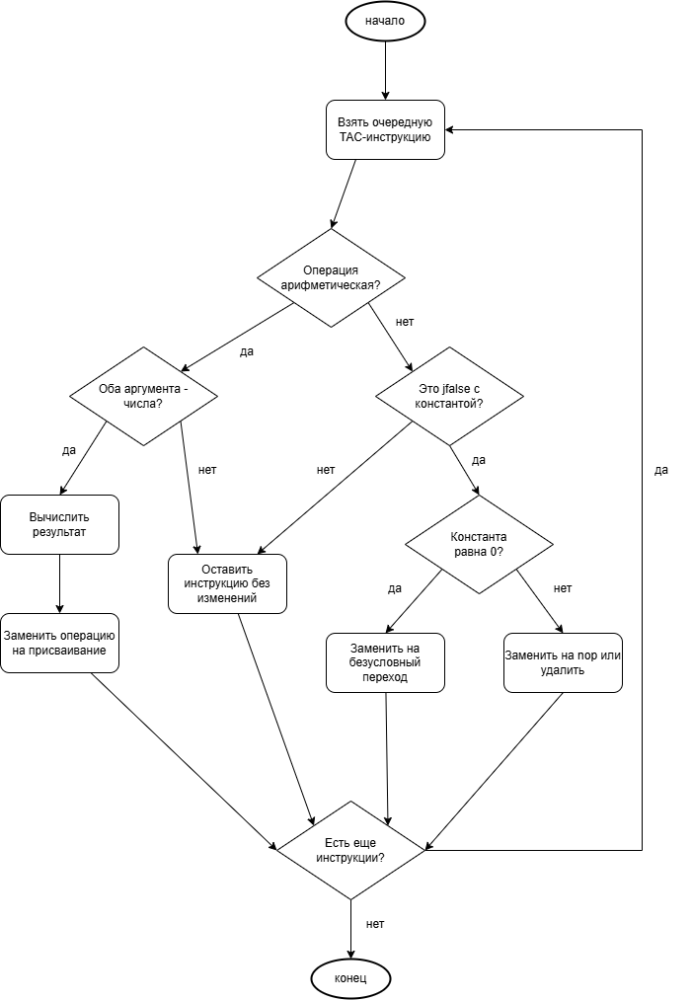

### 6.6. Локальная оптимизация 2: распространение копий

Вторая реализованная оптимизация — **распространение копий**.

Смысл оптимизации: если переменная или временный результат является простой копией другого значения, дальнейшие обращения можно заменить исходным значением.

Пример до оптимизации:

```text
t1 = 5
number = t1
t2 = number < 10
```

После распространения копий:

```text
t1 = 5
number = 5
t2 = 5 < 10
```

Обобщённая блок-схема оптимизации:

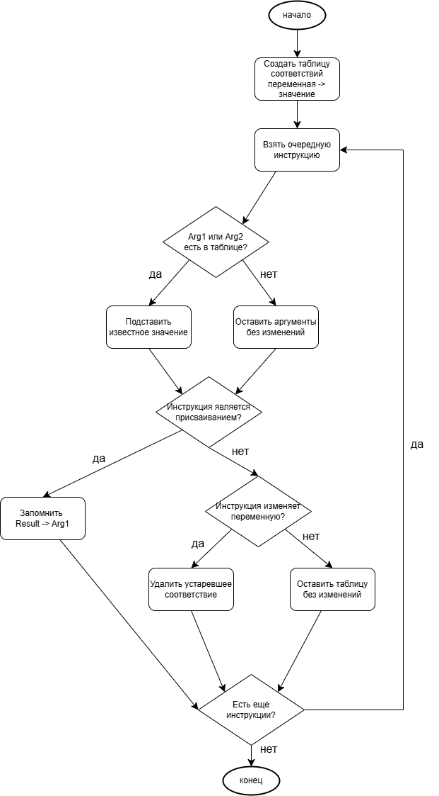

### 6.7. Демонстрация оптимизаций в GUI

Для демонстрации работы дополнительного задания использовался пример:

```c
do {
    number = 2 + 3;
} while (number < 10);
```

В GUI выводятся три блока:

1. исходный трёхадресный код;
2. результат после свёртки констант;
3. результат после распространения копий.

Скриншот работы режима TAC и оптимизаций:

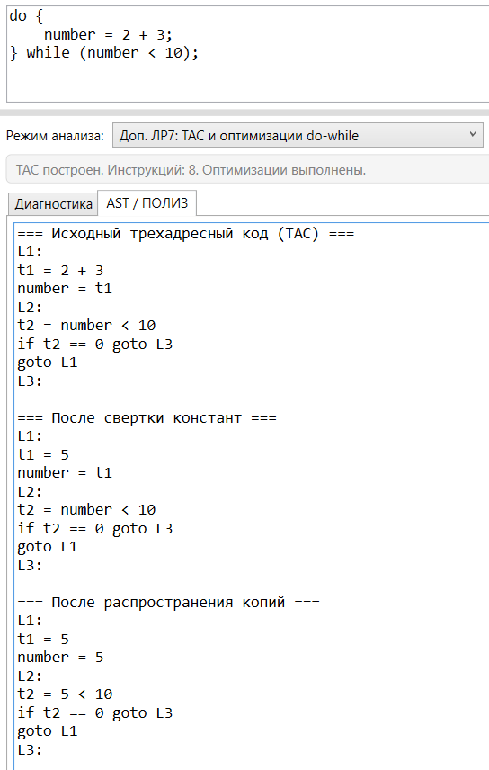

По результату видно, что выражение `2 + 3` преобразуется в константу `5`, а затем значение распространяется дальше по TAC. Оптимизации являются локальными: они работают внутри одной конструкции `do-while` и не требуют анализа всей программы.

### 6.8. Интеграция дополнительного задания в программу

Алгоритм работы режима дополнительного задания:

1. Выполняется лексический анализ входной строки.
2. Если найдены лексические ошибки, TAC не строится.
3. Выполняется синтаксический анализ конструкции `do-while`.
4. Если найдены синтаксические ошибки, TAC не строится.
5. Выполняется семантический анализ и строится AST.
6. По AST генерируется исходный TAC.
7. К TAC применяются две локальные оптимизации:
   - свёртка констант;
   - распространение копий.
8. В GUI выводятся исходный TAC и результаты после каждой оптимизации.

---

## 7. Реализация

### 7.1. Генерация TAC

Генератор TAC работает по AST конструкции `do-while`. Для цикла создаются три метки:

- `L1` — начало тела цикла;
- `L2` — блок проверки условия;
- `L3` — выход из цикла.

Шаблон генерации:

```text
L1:
<тело цикла>
L2:
<условие>
if condition == 0 goto L3
goto L1
L3:
```

Для тела цикла поддерживаются:

- инкремент `++`;
- декремент `--`;
- присваивание;
- арифметические выражения;
- операции сравнения в условии.

### 7.2. Реализованные локальные оптимизации

| Оптимизация | Назначение |
|---|---|
| `FoldConstants` | Вычисляет константные выражения и упрощает условные переходы с константным условием |
| `EliminateCopyChains` | Подставляет известные значения вместо лишних копий и временных переменных |

Обе оптимизации являются локальными, потому что работают с одним списком TAC-инструкций, построенным для одной конструкции `do-while`. Они не изменяют смысл программы, а только упрощают её промежуточное представление.

---

