# Лабораторная работа №2

## Разработка лексического анализатора (сканера)

---

## 1. Название и цель лабораторной работы

**Название:** Разработка лексического анализатора (сканера) для языкового процессора.

**Цель работы:**  
Изучить назначение и принципы работы лексического анализатора в структуре компилятора, спроектировать диаграмму состояний конечного автомата и реализовать программный модуль сканера с интеграцией в ранее разработанный графический интерфейс.

---

## 2. Сведения об авторе

**ФИО:** Вейбер А.С.  
**Группа:** АП-327  
**Дисциплина:** Теория формальных языков и компиляторов

&nbsp;

---

## 3. Описание проекта

В рамках лабораторной работы разработан лексический анализатор для конструкции `do-while` на языке C++ и встроен в приложение, созданное в лабораторной работе №1.

Программа выполняет:

- ввод и редактирование исходного текста;
- запуск лексического анализа по команде **«Пуск»**;
- выделение лексем во входном тексте;
- определение условного кода и типа каждой лексемы;
- вывод результатов анализа в таблицу;
- определение ошибок и переход к позиции ошибочного символа.

Сканер реализован как отдельный класс `LexicalAnalyzer`, который принимает на вход строку и возвращает список лексем. Результат работы выводится в табличную область интерфейса.

---

## 4. Используемые технологии

**Язык программирования:** C#  
**Фреймворк для GUI:** WPF (.NET 8.0)  
**Среда разработки:** Visual Studio 2022  
**Тип приложения:** Desktop application

---

## 5. Инструкция по сборке и запуску

### Путь к готовому исполняемому файлу
Автономный запуск (без Visual Studio)
Для запуска без установленной среды разработки используется автономная сборка (Self-contained).
Готовая версия программы доступна во вкладке Releases данного репозитория.
Порядок запуска:
- Скачать архив publish.zip.
- Распаковать архив в любую папку.
- Запустить файл GUI.exe.

Программа запускается без установленной среды разработки и дополнительных библиотек.

---

## 6. Постановка задачи

Необходимо разработать лексический анализатор в соответствии с индивидуальным вариантом задания, встроить его в приложение из лабораторной работы №1 и обеспечить наглядный вывод результатов.

Сканер должен:

- принимать на вход строку исходного текста программы;
- выделять допустимые лексемы;
- классифицировать лексемы по типам;
- определять позицию каждой лексемы;
- фиксировать недопустимые символы;
- учитывать многострочность текста;
- выводить результат в таблицу с колонками: **код**, **тип**, **лексема**, **местоположение**.

Также должна быть реализована навигация по ошибкам: при щелчке на строке с ошибкой курсор должен переходить к позиции недопустимого символа в редакторе.

---

## 7. Вариант задания

**Вариант:** простой цикл `do-while` на языке C++.

### Основной пример входной конструкции

```cpp
do {
    c = a + b;
    a--;
} while (c >= 0);
```

### Дополнительные корректные примеры

```cpp
do {
    x = y + z;
    y--;
} while (x < 10);
```

```cpp
do {
    sum = a1 + b2;
    a1--;
} while (sum != 10);
```

### Допустимые лексемы

**Ключевые слова:**
- `do`
- `while`

**Идентификаторы:**
- начинаются с буквы или символа `_`;
- могут содержать буквы, цифры и `_`.

**Числа:**
- целые без знака.

**Операторы:**
- `+`, `++`
- `-`, `--`
- `>`, `>=`
- `<`, `<=`
- `=`, `==`
- `!`, `!=`
- `*`, `/`

**Разделители:**
- `{`
- `}`
- `(`
- `)`
- `;`

**Пробельные символы:**
- пробел
- табуляция

---

## 8. Условные коды лексем

| Условный код | Тип лексемы |
|-------------|-------------|
| 1 | целое без знака |
| 2 | идентификатор |
| 3 | ключевое слово |
| 4 | оператор |
| 5 | разделитель |
| 6 | пробельный символ |
| 99 | ошибка |

---

## 9. Диаграмма состояний
После завершения чтения идентификатора выполняется проверка:

- если лексема равна `do` или `while`, ей присваивается код `3`;
- иначе ей присваивается код `2`.

Для операторов предусмотрены как одиночные, так и составные варианты: `++`, `--`, `>=`, `<=`, `==`, `!=`.

**диаграмма:**

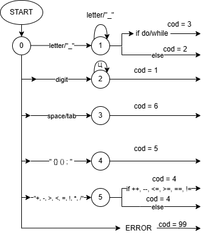

---

## 10. Описание интерфейса и функций (руководство пользователя)

---

### Главное окно

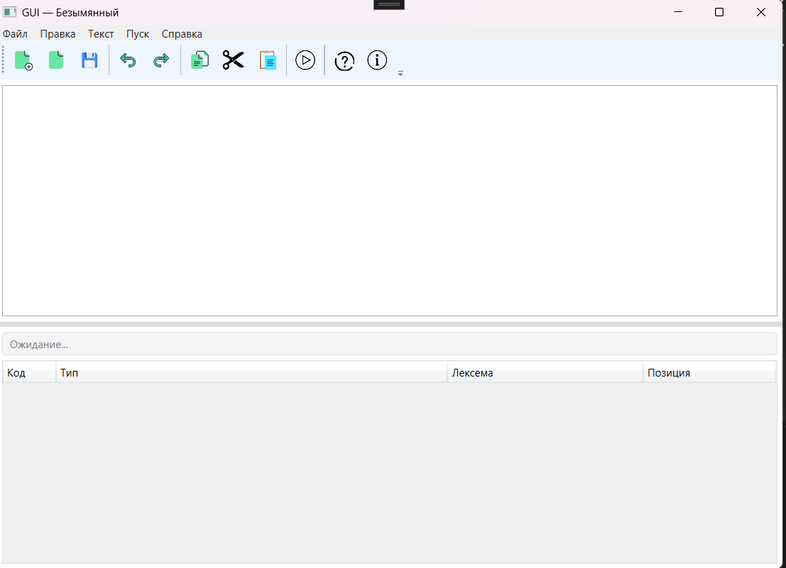

Главное окно содержит:

1. Главное меню  
2. Панель инструментов  
3. Область редактирования текста  
4. Таблицу результатов лексического анализа  
5. Строку состояния

---

### Меню «Файл»

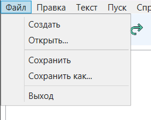

Функции:

- **Создать** — очистка редактора;
- **Открыть** — открытие текстового файла;
- **Сохранить** — сохранение текущего файла;
- **Сохранить как** — сохранение в новый файл;
- **Выход** — завершение работы приложения.

---

### Меню «Правка»

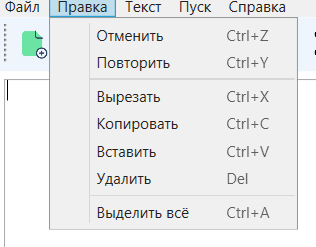

Функции редактирования:

- **Отменить** (`Ctrl+Z`)
- **Повторить** (`Ctrl+Y`)
- **Вырезать** (`Ctrl+X`)
- **Копировать** (`Ctrl+C`)
- **Вставить** (`Ctrl+V`)
- **Удалить** (`Del`)
- **Выделить всё** (`Ctrl+A`)

---

### Меню «Текст»

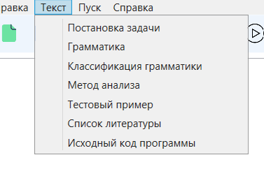

Открывает дополнительные текстовые материалы:

- Постановка задачи
- Грамматика
- Классификация грамматики
- Метод анализа
- Тестовый пример
- Список литературы
- Исходный код программы

---

### Команда «Пуск»

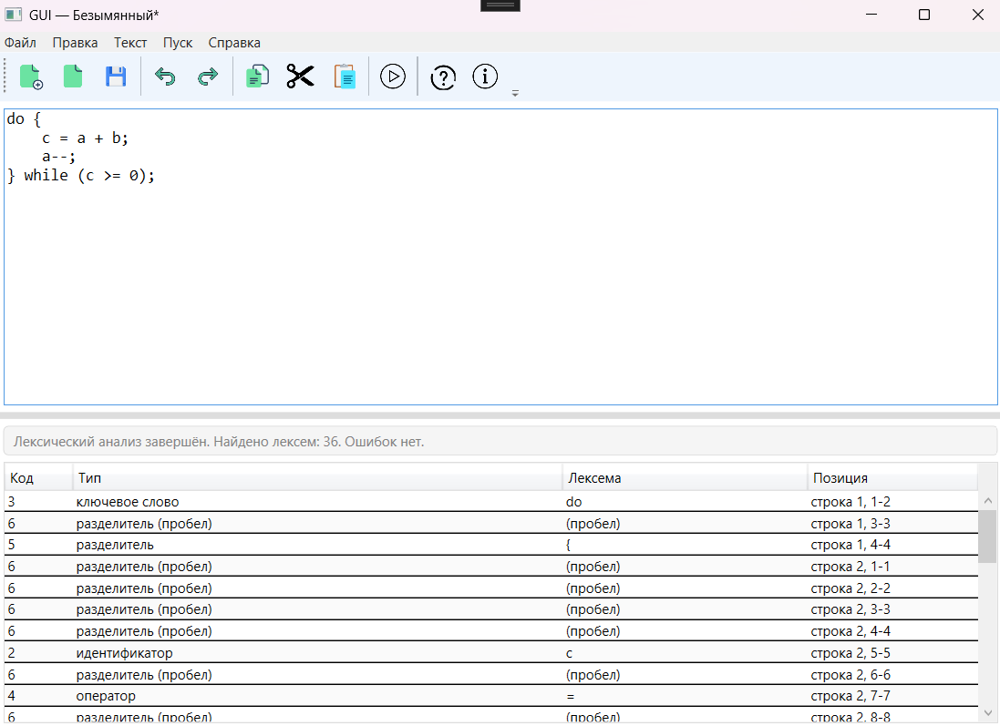

Команда **«Пуск»** запускает лексический анализ текста, введённого в область редактирования.

В результате:

- создаётся список лексем;
- каждой лексеме назначается условный код;
- определяется тип лексемы;
- вычисляется позиция во входном тексте;
- ошибки помечаются отдельно.

Результат отображается в нижней таблице.

---

### Таблица результатов

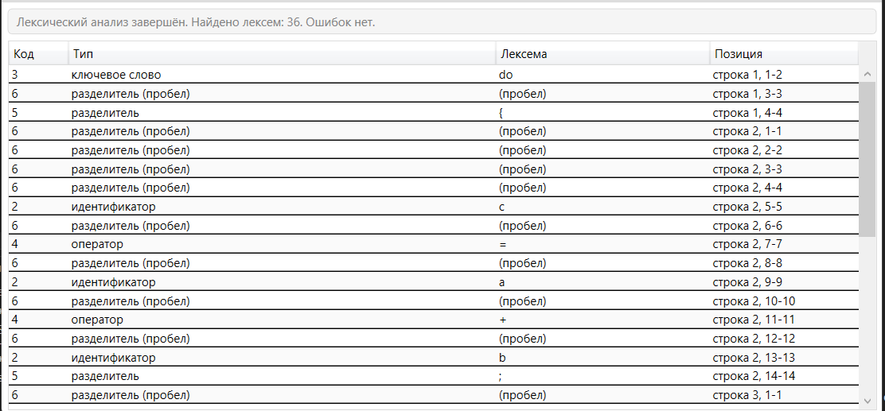

Таблица содержит следующие столбцы:

- **Код**
- **Тип**
- **Лексема**
- **Позиция**

Если в тексте обнаружен недопустимый символ, он выводится как ошибка.

При щелчке по строке с ошибкой курсор в редакторе переходит к проблемному символу.

---

### Панель инструментов

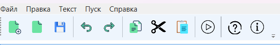

Панель содержит кнопки быстрого доступа к основным функциям программы:

| Кнопка | Назначение |
|--------|------------|
| Создать | Новый документ |
| Открыть | Открытие файла |
| Сохранить | Сохранение файла |
| Отменить | Undo |
| Повторить | Redo |
| Копировать | Copy |
| Вырезать | Cut |
| Вставить | Paste |
| Пуск | Запуск лексического анализа |
| Справка | Открытие справки |
| О программе | Информация о программе |

---

### Меню «Справка»

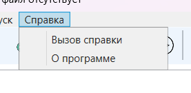

Содержит:

- **Вызов справки** — описание функций программы;
- **О программе** — сведения о проекте и авторе.

---

## 11. Тестовые примеры

### 1. Корректный пример

**Входной текст:**

```cpp
do {
    c = a + b;
    a--;
} while (c >= 0);
```

**Ожидаемый результат:**

- ошибок нет;
- корректно распознаются ключевые слова `do`, `while`;
- корректно распознаются идентификаторы `a`, `b`, `c`;
- корректно распознаются операторы `=`, `+`, `--`, `>=`;
- корректно распознаются разделители `{ } ( ) ;`;
- корректно распознаётся число `0`.

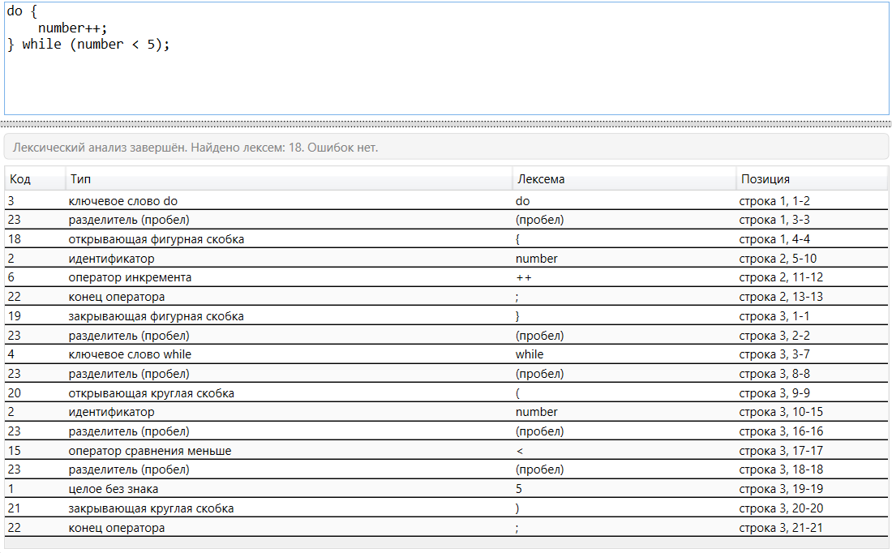

---

### 2. Пример с недопустимым символом

**Входной текст:**

```cpp
do {
    c = a @ b;
    a--;
} while (c >= 0);
```

**Ожидаемый результат:**

- символ `@` определяется как ошибка;
- для него выводится код `99`;
- в таблице указывается позиция символа;
- при щелчке по строке ошибки курсор переходит к символу `@`.

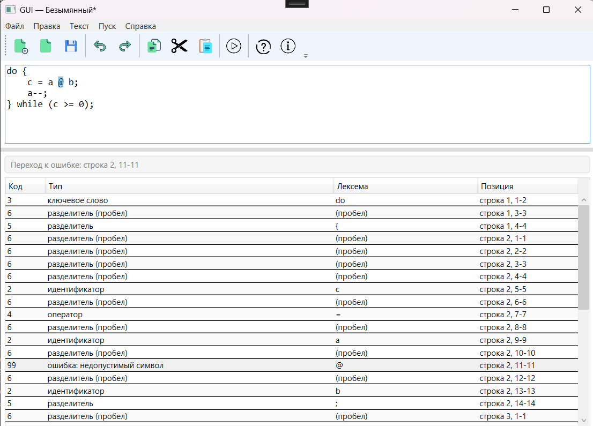

---

## 12. Особенности реализации и ограничения

### Особенности реализации

- Лексический анализатор реализован отдельным классом `LexicalAnalyzer`.
- Результаты анализа выводятся в табличную область.
- Предусмотрен вывод условного кода, типа, текста лексемы и её позиции.
- Реализована навигация по ошибкам.
- Теоретические материалы загружаются из внешних текстовых файлов.

### Ограничения

- Реализован сканер только для лексем, предусмотренных вариантом задания.
- Полный синтаксический анализ конструкции в данной работе не выполняется.
- Комментарии, строковые литералы и другие элементы языка C++ не обрабатываются.

---

## 13. Вывод

В ходе лабораторной работы был разработан и реализован лексический анализатор для конструкции `do-while` на языке C++. Сканер выделяет ключевые слова, идентификаторы, числа, операторы, разделители и пробельные символы, а также определяет недопустимые символы и их позицию. Полученный модуль был встроен в графический интерфейс, созданный ранее, что позволило получить наглядный результат лексического анализа в табличной форме.
